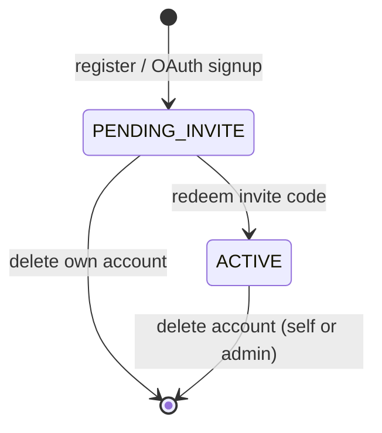
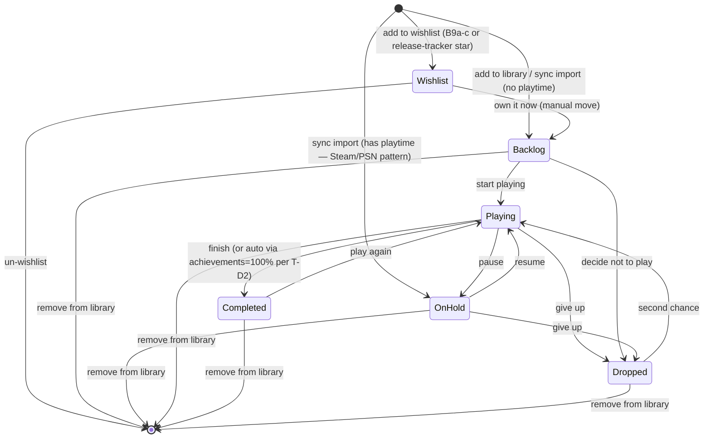
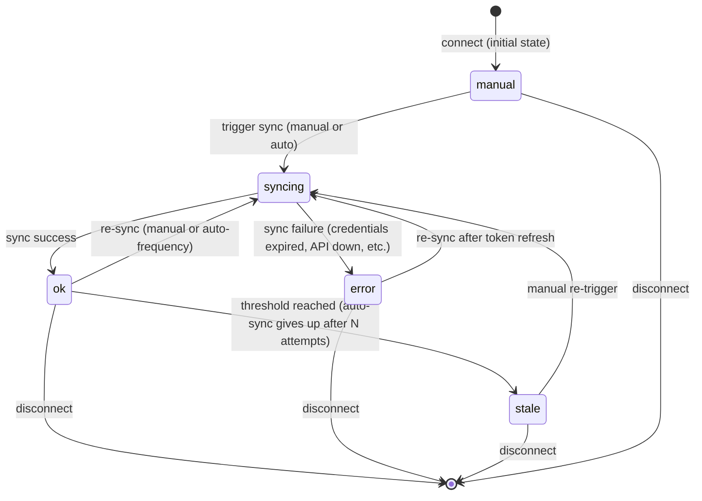
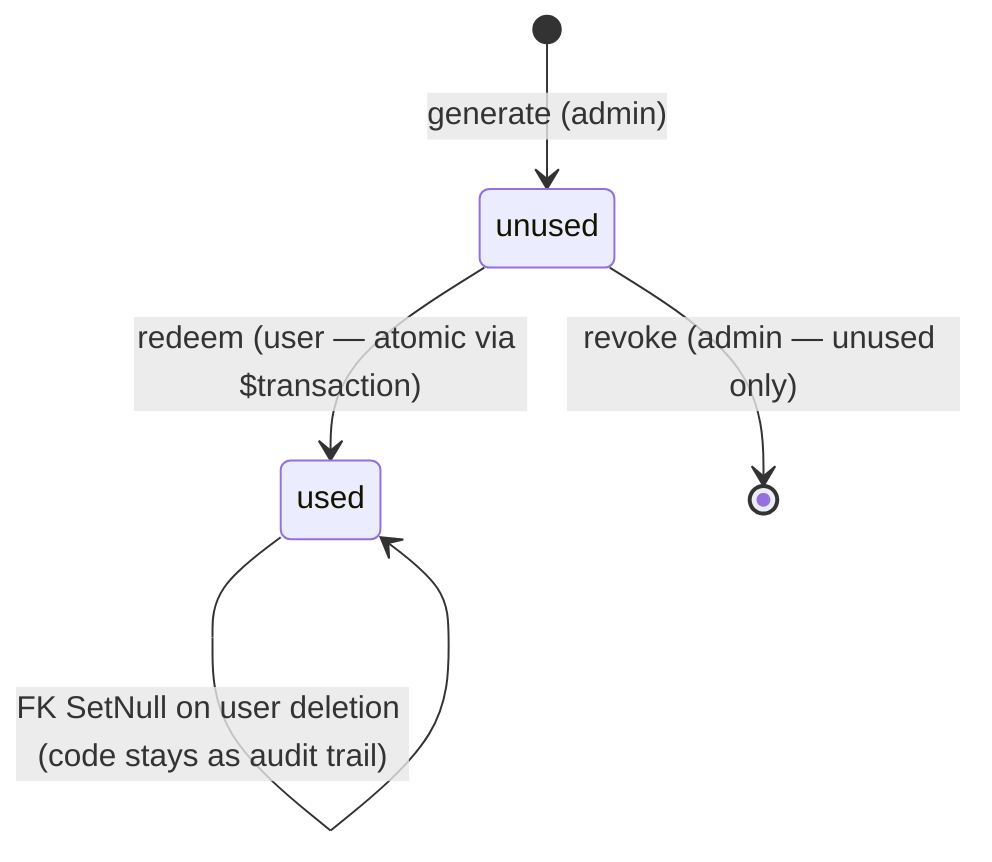

# Hoard — Conceptual Model (2026-05-22)

**Purpose.** Canonical reference for the objects Hoard recognises, their relationships, states, and the vocabulary used everywhere. Output of `/layers-conceptual-model` against the strategic surface in `PRODUCT_STRATEGY.md`.

This is **not a database schema** — it's a design artifact at a higher abstraction. The current Prisma schema (`packages/db/prisma/schema.prisma`) is one implementation of this model; future schema evolutions (horizon-2 bets) trace back here for justification.

Cross-references:
- `packages/db/prisma/schema.prisma` — current implementation (10 entities)
- `docs/PRODUCT_STRATEGY.md` §8 — gaps this model resolves
- `docs/USER_RESEARCH.md` §10 — user needs the model serves
- `AGENT.md` decisions #29, #32, #33 — prior architectural decisions

---

## 1. Two cross-cutting decisions (surfaced before per-entity definitions)

These resolve before Phase 3 because they shape multiple entities.

### CM1. RetroPlatform is a separate entity, distinct from `PlatformCode`

**The problem.** The current `PlatformCode` enum (ST / PS / XB / GG / NT / EP) conflates two things:
1. The user's connected *account* — "Steam account I own, which holds credentials"
2. The game's *platform identity* — "this game is on Steam"

For PC + current-gen consoles these collapse to the same concept because owning a Steam account implies the game is on Steam. For retro consoles they shouldn't: a user doesn't have a "NES account," but they do have NES games.

**Decision.** Introduce **RetroPlatform** as a distinct entity (per-platform reference data: NES, SNES, Game Boy, Genesis, PS1, Saturn, Dreamcast, etc.). The existing `PlatformCode` enum stays as-is for sync-capable digital platforms. UserGame gains an optional `retroPlatformId` FK for entries on retro/obscure platforms.

**Consequence for multi-platform ownership.** If a user owns the same game on multiple retro platforms (e.g., Tetris on Game Boy AND on NES), they have two UserGame rows — one per retroPlatformId. The current `@@unique([userId, gameId])` constraint becomes `@@unique([userId, gameId, retroPlatformId])` (with the null platformId treated as a single bucket via Postgres' nulls-distinct semantics). Open question flagged in §7.

**Why not just expand the PlatformCode enum?** Enum expansion requires schema migrations for every platform addition; ~30+ retro platforms (including obscure ones — Atari Jaguar, FM Towns, etc.) makes that painful. A separate entity also lets each platform carry metadata (eraStartYear, manufacturer, regional variants) that an enum value can't.

### CM2. Collection metadata is optional fields on UserGame, with extraction-on-growth as an evolution path

**The problem.** Per S11 (retro/physical collection as first-class surface), entries for physical/retro need metadata not relevant to synced entries: shelf location, condition (CIB / loose / sealed / replica), region (NTSC-U / NTSC-J / PAL), completeness, authenticity, optional value-tracking.

**Decision.** Optional fields on UserGame initially — `shelfLocation`, `condition`, `region`, `completeness`. If the field set grows beyond ~6–8 attributes (purchase price, purchase date, value-history, photos, etc.), extract to a separate `CollectionMetadata` entity with a 1:1 relationship to UserGame.

**Rationale.** Adding 4 optional fields to UserGame is cheap; introducing a join table for what's currently 4 nullable fields is over-engineering. The extraction path is documented so future-me knows when to refactor.

---

## 2. Object inventory

**Existing (10 entities from `schema.prisma`):**

1. **User**
2. **Platform**
3. **Game**
4. **UserGame**
5. **WishlistRelease**
6. **HltbData**
7. **InviteCode**
8. **PlatformLog**
9. **Feedback**
10. **UserEvent**

**New (5 entities for horizon-2):**

11. **Store**
12. **Deal**
13. **DealAlert**
14. **SubscriptionService**
15. **UserSubscription**
16. **SubscriptionCatalog**
17. **RetroPlatform** *(per CM1)*

---

## 3. Object definitions

### 3.1 User

> *A person with an account on Hoard. The system's primary actor — every other entity belongs to or references a User.*

**Attributes:**
- `id` (cuid)
- `email` (unique, login identifier)
- `name` (optional display name)
- `password` (optional — null for OAuth-only users)
- `googleId`, `steamId` (unique optional, OAuth identities)
- `status` — `PENDING_INVITE | ACTIVE` (closed-beta gating)
- `isAdmin` (boolean — gates admin surface)
- `hasRequestedAccess`, `accessRequestMessage`, `accessRequestedAt` (closed-beta access-request fields)
- Preferences group: `hypeThreshold`, `libraryView`, `showHltb`, `coverDensity`, `terminalCursor`
- `createdAt`, `updatedAt`

**Relationships:**
- has-many `Platform` (0..many)
- has-many `UserGame` (0..many) — the user's library
- has-many `WishlistRelease` (0..many) — release tracker stars
- has-one `InviteCode` as redeemer (0..1)
- has-many `Feedback` (0..many)
- has-many `UserEvent` (0..many)
- has-many `DealAlert` (0..many) *— horizon-2*
- has-many `UserSubscription` (0..many) *— horizon-2*

**Actions (user-facing):**
- Register account (email/password, Google OAuth, Steam OpenID)
- Log in / Log out
- Redeem invite code (pending → active transition)
- Request access (pending users)
- Update preferences
- Delete account (cascades through library, platforms, etc.)

### 3.2 Platform

> *A user's connected account on a sync-capable storefront — credentials + sync state for one platform per user.*

**Attributes:**
- `id`, `userId`, `code` (`PlatformCode` enum: `ST | PS | XB | GG | NT | EP`)
- `credentials` (JSON; shape varies per platform — Steam: `{ steamId }`; PSN: `{ npsso }`; Xbox: `{ apiKey }`)
- `syncable` (boolean; NT/EP currently `false` per CLAUDE.md Hard Rule 6)
- `lastSyncAt` (nullable timestamp)
- `syncStatus` — `ok | syncing | error | stale | manual`
- `syncFrequency` — `FIVE_MIN | FIFTEEN_MIN | HOURLY | MANUAL`
- `createdAt`, `updatedAt`

**Relationships:**
- belongs-to `User`
- has-many `PlatformLog` (0..many)
- `@@unique([userId, code])` — one Platform record per (user, code)

**Actions:**
- **Connect** (create a Platform record; provide credentials)
- **Sync** (manually trigger; auto-trigger by `syncFrequency`)
- **Update credentials** (re-paste token / re-OAuth)
- **Change sync frequency**
- **Disconnect** (delete the Platform record; cascades to PlatformLog)

**State surface — `syncStatus`:** see §4 state diagram.

### 3.3 Game

> *A canonical game identity. One row per real-world game across all platforms, all users.*

**Attributes:**
- `id` (cuid)
- `igdbId` (unique — IGDB is canonical source of truth for game identity)
- `steamAppId` (unique optional — for Steam ID lookups)
- `hltbId` (optional — for HLTB deep links)
- `gogAppId` (optional — for future GOG sync)
- `psnNpCommunicationId` (unique optional — stable PSN identifier captured during trophy sync)
- `title`, `developer`, `releaseYear`, `genres` (string array), `coverUrl`
- `metadata` (JSON — reserved for additional IGDB-derived fields)
- `createdAt`, `updatedAt`

**Relationships:**
- has-many `UserGame` (0..many — across all users)
- has-one `HltbData` (0..1)
- has-many `Deal` (0..many) *— horizon-2*
- has-many `SubscriptionCatalog` (0..many) *— horizon-2*

**Actions:**
- (Internal only) Create / refresh from IGDB metadata
- **Note:** Users don't act on Game directly — they act on UserGame. The Game-detail UI is a UserGame view.

### 3.4 UserGame

> *The user's relationship to a specific Game in their library. The "library row." Every shelf entry is a UserGame; status / playtime / notes live here, not on Game.*

**Attributes:**
- `id`, `userId`, `gameId`
- `status` (`GameStatus` enum: `Playing | Backlog | Completed | OnHold | Dropped | Wishlist`) — **global / per-game** state per CM12
- `playtimeByPlatform` (JSON map: `PlatformCode → minutes`; nullable per-platform) — keys = "platforms owned-on (with playtime)" per CM12
- `wishlistedPlatforms` (string[] — array of `PlatformCode` / `RetroPlatform.shortName`) — **NEW per CM12** — keys = "platforms the user wants this game on." Decoupled from `playtimeByPlatform` because *wishlist intent is per-platform while ownership status is per-game*. Resolves the GTA case (own on PS5, wishlist on PC) — see CM12 + §3.4.2 below.
- `lastPlayedAt` (nullable)
- `notes` (free-form text), `rating` (1–10, nullable)
- `achievementsEarned`, `achievementsTotal`, `achievementsPercent`, `achievementsUpdatedAt` — aggregate achievement progress (all nullable for games without achievement data)
- `addedAt`, `updatedAt`
- **NEW (per strategy):**
  - `sourceType` (`OWNED_PURCHASE | SUBSCRIPTION | BORROWED | DEMO | FREE_PROMOTION`) — default `OWNED_PURCHASE`. *Per S0 / S9 detail-page state.*
  - `mediaType` (`DIGITAL | PHYSICAL_DISC | PHYSICAL_CART | ROM`) — default `DIGITAL`. *Per S7 / S11.*
  - `retroPlatformId` (FK to RetroPlatform, nullable) *per CM1 — only set for entries on retro platforms outside the main PlatformCode enum.*
- **NEW (per CM2 collection metadata, optional fields):**
  - `shelfLocation` (string, nullable) — "Living room cabinet, second shelf"
  - `condition` (`CIB | LOOSE | SEALED | REPLICA`, nullable)
  - `region` (`NTSC_U | NTSC_J | PAL | OTHER`, nullable)
  - `completeness` (string nullable — "missing manual, has case + cart" etc.)

**Relationships:**
- belongs-to `User`
- belongs-to `Game`
- belongs-to `RetroPlatform` (optional, 0..1) *— horizon-2*
- `@@unique([userId, gameId, retroPlatformId])` — extension of current `@@unique([userId, gameId])` to support multi-retro-platform ownership; null retroPlatformId treated as a single bucket via Postgres `nulls distinct` semantics. Open question flagged.

**Actions:**
- **Add to library** (status = `Backlog`, default; configurable per S7 to also `Wishlist`)
- **Add to wishlist** (status = `Wishlist`) — distinct entry-path landing in the Library Wishlist shelf, per S8
- **Change status** (any status → any status, including Playing → Completed, etc.)
- **Update notes** (free-form edit)
- **Rate** (set rating 1–10)
- **Remap** (change which Game this UserGame points to — for wrong-IGDB-match recovery, per N2)
- **Remove from library** (delete the UserGame row)

**State surface — `status`:** see §4 state diagram. **Derived state for detail-page variants (S9):** see §3.4.1.

#### 3.4.1 Derived state for detail-page rendering (per S9)

A UserGame's *display state* is derived from `status` + `sourceType` + the presence of a `WishlistRelease` companion + whether the underlying Game has been released yet. Six display states:

| State | Derivation | Detail-page purpose |
|---|---|---|
| **Owned (synced)** | `status ∈ {Playing, Backlog, Completed, OnHold, Dropped}` AND `sourceType = OWNED_PURCHASE` AND has playtime data | "How I'm playing this" — playtime, trophies, status |
| **Owned (manual)** | Same statuses AND `mediaType ∈ {PHYSICAL_DISC, PHYSICAL_CART, ROM}` OR no playtime data | "What I own" — no sync data; honest about missing fields |
| **Wishlisted, released — digital** | `status = Wishlist` AND past release AND `mediaType=DIGITAL` (or unset) | "Why I want this + where to buy" — gallery, news, reviews, current digital **deals** (§3.12), HLTB |
| **Wishlisted, released — physical** | `status = Wishlist` AND past release AND `mediaType ∈ {PHYSICAL_DISC, PHYSICAL_CART, ROM_CART}` | "Why I want this + where to find a copy" — gallery, news, reviews, current marketplace **listings** (§3.19), region/condition filters, HLTB |
| **Wishlisted, upcoming** | `status = Wishlist` AND has companion `WishlistRelease` with future `releaseDate` | "When can I play this" — countdown, hype, gallery, trailers, news *(content sources per §3.21)* |
| **Subscription-available** | `sourceType = SUBSCRIPTION` | "Playable via [service]" — expiry warning, "active rotation" CTA |
| **Completed** | `status = Completed` | "Memorial / log" — completion date, total playtime, rating |

Display state is computed at render-time, not stored. UI variant routing in `/layers-interaction-flow` and `/layers-surface`.

**Hardware listings live elsewhere.** The table above covers Game display variants. Listings of consoles / controllers / accessories (per §3.19 with `targetType = HARDWARE`) render on **RetroPlatform detail surfaces** (per §3.17 Actions) and on the Collection page (per S11), NOT as a Game detail variant. A "find a SNES" CTA from anywhere in the app deep-links to the SNES RetroPlatform detail page's hardware-listings feed.

#### 3.4.2 The "PLATFORMS" section — owned + wishlisted unified per CM12

A game can simultaneously be **owned on some platforms** and **wishlisted on others** ("GTA case" — Andrea 2026-05-22: user owns GTA V on PS5 because Rockstar released console-first, then wishlists the eventual PC version for a better experience).

The model honors this asymmetry by keeping two distinct collections on UserGame:

- `playtimeByPlatform` — keys = platforms owned-on (with optional playtime data)
- `wishlistedPlatforms` — keys = platforms wanted-on (no playtime, by definition)

The GameDetail surface renders both under a unified **"PLATFORMS"** section (renamed from "OWNED ON" per CM12). Each row shows the platform code + its state — playtime hours for owned platforms, the marker `wishlisted` for wishlisted platforms:

```
// PLATFORMS
PS5 · 42h
ST  · wishlisted
```

**Why the rename matters semantically:** "OWNED ON" claimed ownership across every row in the section. The GTA case can't fit that frame without lying about the PC row. "PLATFORMS" is honest about what's actually displayed — the user's per-platform relationships with this game, owned or wished.

**Shelf logic:** A game appears on the Wishlist shelf if either `status = 'Wishlist'` (global) OR `wishlistedPlatforms.length > 0` (per-platform). GTA V in the GTA case appears on Backlog (via PS5 ownership reflecting global status) AND Wishlist (via PC entry in wishlistedPlatforms) — both intents are legitimate, both shelves surface it. No dedupe.

**Un-wishlist UX per CM12 + S8 alignment:**
- Global `[+ wishlist]` / `[- un-wishlist]` toggle: shortcut that clears ALL of `wishlistedPlatforms` and sets `status` away from `Wishlist` if global
- Per-row `[× un-wishlist]` affordance in the PLATFORMS section row: removes that specific platform from `wishlistedPlatforms`. Collectors editing per-platform get this control; most users use the global toggle.

### 3.5 WishlistRelease

> *A user's tracking of an upcoming game release on the Releases page. The release tracker. Distinct from `UserGame.status='Wishlist'` per S8 — see §6 ubiquitous language.*

**Attributes:**
- `id`, `userId`, `igdbId`
- `title`, `developer`, `releaseDate` (nullable), `releaseDateCategory` (`exact | Q1 | Q2 | Q3 | Q4 | TBA`)
- `platforms` (string array of IGDB platform names — NOT linked to Platform entity), `genres`
- `hype` (nullable Int — IGDB hype score)
- `synopsis`, `coverUrl`
- `category` (Int — IGDB category, e.g., main_game=0, dlc=2, remake=8)
- `createdAt`, `updatedAt`

**Relationships:**
- belongs-to `User`
- implicit relationship to `Game` via `igdbId` (NOT enforced FK — the Game row may not exist yet for upcoming releases that haven't been pulled into anyone's library)
- `@@unique([userId, igdbId])`

**Actions:**
- **Star a release** (create a WishlistRelease, simultaneously creates `UserGame(Wishlist)` per existing transaction)
- **Un-star** (delete the WishlistRelease + delete the UserGame if still `Wishlist` per existing logic)

**Key invariant per S8:** The Library Wishlist shelf includes both:
1. UserGames with a companion WishlistRelease (came via release tracker)
2. UserGames *without* a companion WishlistRelease (came via the new entry paths in B9a/b/c)

Both render in the Library shelf; only the former render on the Releases page. The shelf is **heterogeneous** by design.

### 3.6 HltbData

> *HowLongToBeat playtime estimates for a Game.*

**Attributes:** `id`, `gameId` (unique), `mainStory`, `mainExtras`, `completionist` (all nullable Int — minutes), `source` (`hltb | igdb`), `fetchedAt`

**Relationships:** belongs-to `Game` (1:1)

**Actions:** (system-internal — background fetch; no user actions)

### 3.7 InviteCode

> *A single-use access code for the closed beta.*

**Attributes:** `id`, `code` (unique, format `HOARD-XXXX-XXXX`), `note` (admin-only annotation), `createdAt`, `usedAt`, `usedById` (unique nullable — 1:1 with User)

**Relationships:** has-one `User` as redeemer (0..1, `onDelete: SetNull` per A1)

**Actions:**
- **Generate** (admin)
- **Redeem** (user — moves to `ACTIVE`)
- **Revoke** (admin — unused only; used codes can't be revoked since the user is already active)

### 3.8 PlatformLog

> *An entry in the activity feed for a Platform — captures sync events, errors, library import counts.*

**Attributes:** `id`, `platformId`, `userId`, `level` (`info | warn | error`), `event` (machine-readable tag like `sync.started`, `library.imported`), `message` (human-readable), `details` (JSON nullable), `createdAt`

**Relationships:** belongs-to `Platform` (and transitively to `User`)

**Actions:** (read-only on Platform detail Log tab; system writes via `logPlatform()` helper)

### 3.9 Feedback

> *A user-submitted feedback note. Shipped by F-series.*

**Attributes:** `id`, `userId`, `message`, `viewport` (nullable), `ua` (nullable), `read` (boolean, default false), `createdAt`

**Relationships:** belongs-to `User` (cascade-delete)

**Actions:**
- **Submit** (user)
- **Mark read / Mark unread** (admin — toggle the `read` boolean)
- *[Planned]* **Delete** (admin — deferred to admin-IA workstream per CLAUDE.md known-gaps)

### 3.10 UserEvent

> *A telemetry event — an immutable fact about something the user did. Shipped by TL-series.*

**Attributes:** `id`, `userId`, `event` (free-form tag like `session.opened`, `sync.first`, `wishlist.toggled`), `details` (JSON nullable), `createdAt`

**Relationships:** belongs-to `User` (cascade-delete)

**Actions:**
- (System-internal write via `logEvent()` helper)
- (Admin read via `/admin/events`)
- *(Immutable per TL-D10 — no PATCH/DELETE.)*

### 3.11 Store *(horizon-2, per S10)*

> *A storefront where games can be purchased — first-party (Steam / PSN / Xbox / Nintendo eShop / GOG / Epic) or third-party (Instant Gaming / Kinguin / GMG / G2A).*

**Attributes:**
- `id`, `name` (display name)
- `kind` (`FIRST_PARTY | THIRD_PARTY | AGGREGATOR`)
- `region` (optional — `US | EU | etc.`)
- `affiliateUrlPattern` (optional — for deep-link generation with affiliate codes)
- `iconUrl` (optional)
- `enabled` (boolean — for the S10a third-party inclusion toggle)

**Relationships:** has-many `Deal`

**Actions:** (admin-curated; reference data)

### 3.12 Deal *(horizon-2, per S10)*

> *A current price offer for a Game from a Store. Represents "current best price snapshot." Historical pricing is an open question (see §7).*

**Attributes:**
- `id`, `gameId`, `storeId`
- `currentPrice` (cents), `originalPrice` (cents), `discountPct` (Int 0–100)
- `currency` (`USD | EUR | etc.`)
- `url` (deep link to the store listing)
- `availability` (`IN_STOCK | OUT_OF_STOCK | DRM_FREE | KEY_RESELLER` etc.)
- `fetchedAt` (timestamp — staleness signal)

**Relationships:**
- belongs-to `Game`
- belongs-to `Store`
- `@@unique([gameId, storeId, currency])` — one current Deal per Game+Store+currency combo

**Actions:** (system-internal write via IsThereAnyDeal sync; user reads on detail pages + wishlist price-radar)

### 3.13 DealAlert *(horizon-2, per S10)*

> *A user-set price alert on a Game.*

**Attributes:**
- `id`, `userId`, `gameId`
- `thresholdPrice` (cents), `currency`
- `active` (boolean), `createdAt`, `lastTriggeredAt` (nullable)

**Relationships:** belongs-to `User` (cascade), belongs-to `Game`

**Actions:**
- **Set alert** (user — creates DealAlert)
- **Edit threshold**
- **Deactivate** (toggle active = false; keeps row for history)
- **Delete** (remove the alert entirely)

### 3.14 SubscriptionService *(horizon-2, per S0 + S9)*

> *A gaming subscription service — Xbox Game Pass (PC + Console), PS Plus Catalog + Premium, EA Play, Ubisoft+.*

**Attributes:**
- `id`, `name` (display name)
- `kind` (`GAME_PASS_PC | GAME_PASS_CONSOLE | PS_PLUS_CATALOG | PS_PLUS_PREMIUM | EA_PLAY | UBISOFT_PLUS | ...`)
- `provider` (`MICROSOFT | SONY | EA | UBISOFT | ...`)
- `enabled` (boolean — for staged rollout)

**Relationships:** has-many `UserSubscription`, has-many `SubscriptionCatalog`

**Actions:** (admin-curated reference data)

### 3.15 UserSubscription *(horizon-2)*

> *A user's membership in a subscription service. Manually declared by the user; not auto-detected (no API for "do you have Game Pass?").*

**Attributes:**
- `id`, `userId`, `subscriptionServiceId`
- `active` (boolean), `renewsAt` (nullable timestamp)
- `createdAt`, `updatedAt`

**Relationships:** belongs-to `User` (cascade), belongs-to `SubscriptionService`. `@@unique([userId, subscriptionServiceId])`.

**Actions:**
- **Declare** (user marks "I have Game Pass")
- **Deactivate** (user lost the subscription — keeps row for history)
- **Delete** (remove entirely)

### 3.16 SubscriptionCatalog *(horizon-2)*

> *A many-to-many join: this Game is in this SubscriptionService's catalog as of fetchedAt. Used to derive "playable for me right now" when crossed with UserSubscription.*

**Attributes:**
- `id`, `subscriptionServiceId`, `gameId`
- `addedAt` (when the game entered the catalog), `removedAt` (nullable — when it left)
- `fetchedAt` (last refresh timestamp)

**Relationships:** belongs-to `SubscriptionService`, belongs-to `Game`. `@@unique([subscriptionServiceId, gameId])`.

**Actions:** (system-internal sync; user reads via derived "playable via subscription" filter)

### 3.17 RetroPlatform *(horizon-2, per CM1 + S11)*

> *A retro / niche gaming platform that's not currently sync-capable — NES, SNES, Game Boy, Genesis, PS1, Saturn, Dreamcast, Atari 2600, etc.*

**Attributes:**
- `id`, `name` (display: "Nintendo Entertainment System")
- `shortName` ("NES")
- `manufacturer` (`NINTENDO | SEGA | SONY | ATARI | MICROSOFT | OTHER`)
- `eraStartYear`, `eraEndYear` (Int)
- `kind` (`HOME_CONSOLE | HANDHELD | COMPUTER | ARCADE | PERIPHERAL`)
- `regionalVariants` (string array — "Famicom" as a variant of NES)

**Relationships:**
- has-many `UserGame` (via `UserGame.retroPlatformId`)
- has-many `UserHardware` (via `UserHardware.retroPlatformId`) — what hardware the user *owns / wants / used to own* for this platform (per §3.20)
- has-many `MarketplaceListing` (via `MarketplaceListing.retroPlatformId`, only when `targetType = HARDWARE`) — listings of consoles, controllers, accessories specific to this platform

**Actions:** (admin-curated reference data; user reads via library / collection page AND via hardware-listing feeds — "find a SNES console", "find a Super Game Boy", etc. The detail surface for a RetroPlatform shows three lanes: **owned hardware** (per §3.20), **owned games** (per UserGame.retroPlatformId), **marketplace listings** (per §3.19).)

### 3.18 Marketplace *(horizon-2, per S10 + new S12 — secondhand-listing extension)*

> *A secondhand marketplace where physical games can be bought from other people — eBay, Vinted, Mercari, Mercato (Italian secondhand), Yahoo Auctions Japan, Heritage Auctions, retro game specialty stores. Distinct from `Store` (single canonical price per item) because marketplaces have many concurrent listings per item, each with different condition / region / price / seller.*

**Attributes:**
- `id`, `name` (display: "eBay" / "Vinted" / etc.)
- `kind` (`GENERAL_MARKETPLACE | SPECIALIST_RETRO | AUCTION_HOUSE`) — eBay is general; Stone Age Gamer / Capsule Computers are specialist; Heritage is auction-house
- `region` (optional — `US | EU | JP | etc.` — Mercari is JP-leaning, Vinted is EU-leaning, eBay global)
- `apiAccess` (`OFFICIAL_API | UNOFFICIAL_API | SCRAPE_ONLY | NONE`) — affects which marketplaces we can integrate at all
- `iconUrl`, `enabled` (boolean — for staged rollout / per-region availability)

**Relationships:** has-many `MarketplaceListing`

**Actions:** (admin-curated reference data, similar to Store)

### 3.19 MarketplaceListing *(horizon-2, per S10 + S12; polymorphic per CM9)*

> *One specific secondhand listing on a Marketplace. The target is **either** a Game (a cartridge / disc) **or** a piece of Hardware (a console, controller, accessory, cable, or console-with-games bundle). Many listings per target per Marketplace — this is the key shape difference from `Deal`.*

**Attributes:**
- `id`, `marketplaceId`
- `targetType` (`GAME | HARDWARE`) — discriminator
- `gameId` (FK to Game, nullable — set when `targetType = GAME`)
- `retroPlatformId` (FK to RetroPlatform, nullable — set when `targetType = HARDWARE`)
- `hardwareKind` (`CONSOLE | CONTROLLER | ACCESSORY | CABLE | CONSOLE_BUNDLE | OTHER`, nullable — set when `targetType = HARDWARE`. `CONSOLE_BUNDLE` covers eBay's common "SNES + 5 games + 2 controllers" listings that don't disambiguate cleanly.)
- `hardwareCompleteness` (`CONSOLE_ONLY | BOXED | CIB | WITH_ACCESSORIES`, nullable — only meaningful when `hardwareKind = CONSOLE`)
- `externalListingId` — the marketplace's own ID for the listing (idempotent updates)
- `url` — direct link to the listing
- `title` — the listing's own title (load-bearing for HARDWARE where the eBay/Vinted text is often the only signal of what's actually included)
- `price` (cents), `currency`
- `condition` (`CIB | LOOSE | SEALED | REPLICA | GRADED`) — shared between Game listings (CIB / loose / sealed cart) and Hardware listings (LOOSE = console pulled from a junk drawer; CIB = console-in-box with manuals; SEALED = factory-sealed console — rare but exists for collectors)
- `region` (`NTSC_U | NTSC_J | PAL | OTHER` — region of the item itself, not the seller. Critical for hardware too: a PAL SNES won't accept NTSC carts without modding.)
- `mediaType` (`PHYSICAL_DISC | PHYSICAL_CART | ROM_CART | DIGITAL_KEY`, nullable — only meaningful for Game listings)
- `sellerName` (optional, marketplace-specific identifier)
- `sellerLocation` (optional — affects shipping cost / time)
- `sellerRating` (optional — float 0..5 or marketplace-specific)
- `listedAt` (when the listing went up)
- `fetchedAt` (when Hoard last refreshed this row)
- `active` (boolean — false when the listing is sold/removed/expired)

**Constraints:**
- **Exactly one of `(gameId, retroPlatformId)` is set** — enforced at the application layer + a DB CHECK constraint. Matches `targetType`.
- **Hardware-only fields** (`hardwareKind`, `hardwareCompleteness`) are non-null iff `targetType = HARDWARE`.
- **Game-only fields** (`mediaType`) are non-null iff `targetType = GAME` (DIGITAL_KEY listings notwithstanding — those are still Game-targeted).

**Relationships:**
- belongs-to `Marketplace`
- belongs-to `Game` (optional, via `gameId`)
- belongs-to `RetroPlatform` (optional, via `retroPlatformId`)
- `@@index([gameId, active, price])` — fast "show me all active listings for this game, cheapest first"
- `@@index([retroPlatformId, hardwareKind, active, price])` — fast "show me all active SNES console listings, cheapest first"

**Actions:** (system-internal write via marketplace sync; user reads on detail pages of physical-wishlisted Games AND on RetroPlatform detail / Collection surfaces for Hardware)

**Key model decisions:**
- **Polymorphic target via discriminator + nullable FKs** *(per CM9)* — rejected the alternatives of separate `HardwareListing` entity (would duplicate marketplace + price + condition + region attributes + sync flow) and a separate `Collectible` supertype (over-engineered for v1).
- **Many listings per target per Marketplace** — no unique constraint on (target, marketplaceId). A SNES console might have 200 eBay listings concurrently.
- **`active` is a sticky flag, not a deletion** — listings come and go; we keep historical rows for "what did this go for over the last 6 months" trend data. Pruning policy = open question.
- **Aggregation is derived, not stored** — "median price" / "lowest price" / "recent sales" are computed on read, not cached. Until the listing volume forces an aggregate-cache, simple `findMany` + JS reduce is fine.
- **`CONSOLE_BUNDLE` is a deliberate escape hatch** — many real eBay listings are "SNES + 7 games + AV cable + 2 controllers" where forcing the sync flow to disambiguate which targets are included would be brittle. Bundle listings render in a separate UI lane ("// bundles · 12") rather than mixing with single-target listings.

### 3.20 UserHardware *(horizon-2, per CM10 + S13 — hardware ownership is in scope)*

> *A user's relationship to a specific piece of gaming hardware they own (or want to own, or used to own). Mirrors `UserGame` for software — the join entity between User and the hardware reference data. Distinct from `MarketplaceListing` (which is about discovery — what's available to buy from other people).*

**Attributes:**
- `id`, `userId`
- `retroPlatformId` (FK to RetroPlatform — the console family this item belongs to)
- `hardwareKind` (`CONSOLE | CONTROLLER | ACCESSORY | CABLE | OTHER` — same enum as MarketplaceListing minus `CONSOLE_BUNDLE`; you own the things that came out of a bundle, not the bundle itself, with one tolerated edge case: a sealed-bundle collector item can be tracked as `CONSOLE` with `hardwareCompleteness=BOXED` + notes)
- `displayName` (string, optional but recommended — free-text label like "Super Game Boy" / "Multitap" / "MiSTer FPGA" / "Henrik's RGB mod cable." Resolves the "many things share `hardwareKind=ACCESSORY`" problem without forcing a `HardwareItem` reference catalog per OQ-17.)
- `status` (`OWNED | WISHLIST | SOLD | DROPPED`)
- `quantity` (Int, default 1 — "3 SNES controllers" as one row; users who care about per-item condition split into separate rows)
- `condition` (`Condition` enum — same as MarketplaceListing: `LOOSE | CIB | SEALED | REPLICA | GRADED`. `GRADED` rare for hardware but exists at the very top of the collector market for sealed consoles.)
- `region` (`Region` enum: `NTSC_U | NTSC_J | PAL | OTHER` — load-bearing for retro; PAL SNES won't accept NTSC carts unmodded)
- `hardwareCompleteness` (`CONSOLE_ONLY | BOXED | CIB | WITH_ACCESSORIES`, optional — meaningful when `hardwareKind = CONSOLE`)
- `modded` (boolean, default false — region mod / RGB mod / HDMI mod / internal SSD / etc.)
- `modNotes` (text, optional — what was modded, by whom, when)
- `testedWorking` (boolean, optional — collectors who buy "untested" lots want to record verification status)
- `acquisitionDate` (DateTime, optional — when you got it)
- `acquisitionPrice` (Int cents, optional — what you paid)
- `acquisitionMarketplaceId` (FK to Marketplace, optional — where you got it, soft signal for "track my collection value via marketplace listings on the same surface")
- `notes` (text, optional)
- `createdAt`, `updatedAt`

**Relationships:**
- belongs-to `User`
- belongs-to `RetroPlatform`
- belongs-to `Marketplace` (optional, via `acquisitionMarketplaceId` — soft, no cascade)
- **NO hard FK to `MarketplaceListing`** — listings are transient (sold / removed / expired); ownership is durable. "I got this!" UX pre-fills UserHardware fields from a listing but doesn't bind them.

**State transitions:**
```
[create] → WISHLIST → OWNED → SOLD
                ↓        ↓       ↓
              DROPPED  DROPPED  (terminal)
```
- `OWNED → SOLD` preserves acquisition history (useful for "I sold my SNES last year — find one again")
- `OWNED → DROPPED` for items destroyed / lost / given away without sale
- `WISHLIST → DROPPED` = no longer want
- `SOLD` and `DROPPED` rows stay in the database for collection-history queries; default UI filters them out

**Actions:**
- create (add hardware to ownership / wishlist)
- updateStatus (transition)
- edit (condition, region, modded, notes, etc.)
- delete (hard-remove — for entries created by mistake; SOLD/DROPPED is the soft-remove path)
- "I got this!" pre-fill from a `MarketplaceListing` (UX-level shortcut, not a model relationship)

**Key model decisions:**
- **Free-text `displayName` instead of HardwareItem reference catalog** *(per CM10)* — users describe their items in their own words. The `(retroPlatformId, hardwareKind, displayName)` triple is rich enough for v1 search ("show me my SNES accessories" / "do I have a Super Game Boy?"). HardwareItem reference table (OQ-17) stays deferred until cohort signal demands structured matching for price-tracking / cross-user catalog completion stats.
- **Quantity field rather than multi-row** — "3 SNES controllers" is one row with `quantity=3`. Split into separate rows when per-item condition matters (e.g., one CIB + two LOOSE).
- **Soft link to MarketplaceListing**, not hard FK — listings are transient; ownership is durable. A SOLD listing referenced by FK would either pollute the model with dangling references or force restrictive cascade behavior. The pre-fill UX gets all the practical benefit without the integrity cost.
- **`SOLD` and `DROPPED` are soft-deletes** — collection history matters: "I used to own a SNES; sold it 2 years ago; want one again" is a real collector state, and the original acquisition price / region / mod status is data worth keeping for context on the next purchase.

### 3.21 External content cache *(horizon-2, entity shape DEFERRED — see §7 OQ-11)*

> *Per §3.4.1, the wishlisted-upcoming and wishlisted-released detail variants reference news, gallery, trailers, and review content. These come from external sources (IGDB media endpoints, news aggregators, OpenCritic / Metacritic, etc.) and need to be cached so the detail page renders without round-tripping every external API on each view.*

**This entity's shape is deliberately deferred** to a focused design pass (parallel to how Deals is its own domain). Two candidate models surfaced for the next pass:

#### Candidate A — single umbrella entity `GameContent`

| Field | Notes |
|---|---|
| `id`, `gameId` | belongs to Game |
| `kind` | `NEWS` / `GALLERY_IMAGE` / `VIDEO` / `TRAILER` / `REVIEW_SNIPPET` / `SOCIAL_POST` |
| `title` | optional — relevant for news + reviews |
| `url` | external link |
| `mediaUrl` | optional — for images / videos |
| `publishedAt` | optional |
| `source` | string — `IGDB` / `OpenCritic` / `RSS:<feed-url>` / etc. |
| `summary` | text snippet |
| `fetchedAt` | when Hoard last refreshed this row |

**Pro:** one table, one query per game. Simple polymorphic UI rendering by `kind`.
**Con:** sparse columns (a gallery image has no `summary`; a news item has no `mediaUrl` in the image sense). Storage is fine but type discipline is loose.

#### Candidate B — split per kind

Three separate entities: **`NewsItem`** (title, url, publishedAt, source, summary), **`GameMedia`** (kind=image/video/trailer, mediaUrl, dimensions, source), **`ReviewSnippet`** (score, scoreOutOf, reviewerName, source, snippet, url).

**Pro:** each table has tight, well-typed attributes. Query patterns per kind are clean.
**Con:** three tables, three sync flows, three admin sections.

#### What this layer can lock now (vs. defer)

**Locked here:**
- External content needed for detail-page variants WILL be cached in Hoard's DB (not fetched on-demand). Reasons: (1) external APIs have rate limits, (2) the terminal-aesthetic UI shouldn't show "loading..." spinners on every detail-page open, (3) we want graceful degradation when external sources are down.
- Cache invalidation policy is **time-based per-source** (refresh every N hours per source kind), not event-based.
- Content rows have `fetchedAt` for staleness signal (analogous to HltbData).
- Hoard does NOT auto-curate / editorialize content. It's a cache of upstream sources.

**Deferred:**
- Candidate A vs. Candidate B entity shape — pick during the content-source workstream
- Which sources to integrate first (IGDB-only? IGDB + OpenCritic?) — strategic decision
- Whether old content gets pruned (probably yes after 60–90 days for news; gallery is more permanent)
- Where the data caching lives (DB? Edge cache? Both?)

**Why this is conceptual-model territory:** the existence of cached external content as part of the product's model affects UserGame's detail-page state derivation (§3.4.1) — without it, those variants are just promises in a table. The shape decision (A vs. B) is the genuinely-deferred piece.

### 3.22 UserApiKey *(horizon-2, per CM11 + S14 — BYO API key for AI features)*

> *A user's own API key for a third-party AI provider, brought into Hoard so cost-bearing AI features can run without Hoard touching money. Per S14, Hoard does not process payments — users pay the provider directly via their own account.*

**Attributes:**
- `id`, `userId`
- `provider` (`ApiProvider` enum — `ANTHROPIC` at v1; future `OPENAI` / `GOOGLE_VISION` per OQ-19)
- `encryptedKey` (string — encrypted at rest with an app-level master key; never returned in plaintext after creation)
- `keyFingerprint` (string — last 4 chars of the key, for "is this still the right key?" display)
- `label` (string, optional — user-supplied: "personal account" / "work key" / "rate-limited account" — useful for users who rotate keys)
- `isActive` (boolean — soft-disable without delete; only one active key per (user, provider))
- `lastUsedAt` (DateTime, optional)
- `lastErrorAt` (DateTime, optional — when the provider last rejected this key)
- `lastErrorMessage` (string, optional, truncated — for "key was rejected — please rotate" UX)
- `createdAt`, `updatedAt`

**Constraints:**
- **`@@unique([userId, provider, isActive]) WHERE isActive = true`** — at most one active key per (user, provider). Inactive rows (rotated history) accumulate.
- **`encryptedKey` is never logged, never returned to the client after save, never exposed via any API response.** `keyFingerprint` is the only client-visible identifier.
- **`onDelete: Cascade` on the userId FK** — same GDPR-shaped reasoning as F-D1 / TL-D1; deleting an account removes all API keys.

**Relationships:**
- belongs-to `User` (cascade on delete)

**State transitions:**
```
[create] → ACTIVE → INACTIVE  (user toggle: pause feature)
              ↓        ↓
           INVALID  (terminal — must rotate)
              ↓
           DELETED (hard-remove)
```
- `ACTIVE → INVALID` set automatically when the provider rejects the key on a call (B13b error handling). UI shows "this key was rejected — please rotate" with a deep-link to the settings flow.
- `ACTIVE ↔ INACTIVE` is user-toggleable for "I want to pause AI features without losing my key."
- Hard delete is allowed at any time; cascade on user delete.

**Actions:** (all in Settings → AI features per B13a)
- create (paste key, label, save)
- rotate (replace encryptedKey + keyFingerprint, reset error state)
- toggleActive (pause / resume)
- delete (hard-remove)

**Key model decisions:**
- **Encryption at rest is non-negotiable.** App-level master key in env var (`API_KEY_ENCRYPTION_SECRET`), rotatable via a re-encryption migration. Per OWASP / industry baseline — API keys are credentials.
- **Never returned in plaintext after save.** Even to the same user. `keyFingerprint` (last 4 chars) is the only post-save identifier. This is standard credentials-handling hygiene — match what Anthropic/Stripe/etc. do in their own dashboards.
- **No `UserCredits` entity** — per S14 + CM11, Hoard does not process payments. The credit-balance path was rejected in favor of BYO key only. If a future decision reverses S14, that would be a meaningful strategic shift, not a small model add.
- **`isActive` rather than soft-delete** — gives users a "pause AI features" toggle without losing their key. Inactive rows persist for rotation history; hard-delete is also available.
- **`UserEvent` (TL-series) logs AI calls** without storing prompt/response payloads (privacy + storage hygiene). Sufficient for cost-awareness UX ("you've made N Claude vision calls this month — your Anthropic account is the source of truth on actual €€€"). Hoard does NOT track or display monetary cost — that's the provider's dashboard.

---

## 4. Object map (Phase 4 — ERD)

```mermaid
erDiagram
    User ||--o{ Platform : owns
    User ||--o{ UserGame : has
    User ||--o{ UserHardware : owns-hardware
    User ||--o{ WishlistRelease : stars
    User ||--o| InviteCode : redeemed
    User ||--o{ Feedback : submits
    User ||--o{ UserEvent : produces
    User ||--o{ DealAlert : sets
    User ||--o{ UserSubscription : holds
    User ||--o{ UserApiKey : configures

    Platform ||--o{ PlatformLog : logs

    Game ||--o{ UserGame : referenced-by
    Game ||--o| HltbData : has
    Game ||--o{ Deal : has-prices
    Game ||--o{ SubscriptionCatalog : in-catalog

    UserGame }o--o| RetroPlatform : platform-of-copy
    RetroPlatform ||--o{ UserHardware : owned-by

    Store ||--o{ Deal : offers

    Game ||--o{ MarketplaceListing : listed-on
    RetroPlatform ||--o{ MarketplaceListing : has-hardware-listings
    Marketplace ||--o{ MarketplaceListing : hosts

    SubscriptionService ||--o{ UserSubscription : membered-by
    SubscriptionService ||--o{ SubscriptionCatalog : includes

    User {
        string id PK
        string email
        UserStatus status
        boolean isAdmin
        json preferences
    }

    Platform {
        string id PK
        string userId FK
        PlatformCode code
        json credentials
        SyncStatus syncStatus
        SyncFrequency syncFrequency
    }

    Game {
        string id PK
        int igdbId
        string title
        string coverUrl
    }

    UserGame {
        string id PK
        string userId FK
        string gameId FK
        GameStatus status
        json playtimeByPlatform
        json wishlistedPlatforms
        SourceType sourceType
        MediaType mediaType
        string retroPlatformId FK
    }

    WishlistRelease {
        string id PK
        string userId FK
        int igdbId
        timestamp releaseDate
        int hype
    }

    Deal {
        string id PK
        string gameId FK
        string storeId FK
        int currentPrice
        timestamp fetchedAt
    }

    Store {
        string id PK
        string name
        StoreKind kind
    }

    Marketplace {
        string id PK
        string name
        MarketplaceKind kind
        string region
    }

    MarketplaceListing {
        string id PK
        ListingTarget targetType
        string gameId FK
        string retroPlatformId FK
        HardwareKind hardwareKind
        HardwareCompleteness hardwareCompleteness
        string marketplaceId FK
        int price
        Condition condition
        Region region
        boolean active
        timestamp fetchedAt
    }

    UserHardware {
        string id PK
        string userId FK
        string retroPlatformId FK
        HardwareKind hardwareKind
        string displayName
        HardwareOwnershipStatus status
        int quantity
        Condition condition
        Region region
        HardwareCompleteness hardwareCompleteness
        boolean modded
        timestamp acquisitionDate
        int acquisitionPrice
    }

    UserApiKey {
        string id PK
        string userId FK
        ApiProvider provider
        string encryptedKey
        string keyFingerprint
        string label
        boolean isActive
        timestamp lastUsedAt
        timestamp lastErrorAt
    }

    DealAlert {
        string id PK
        string userId FK
        string gameId FK
        int thresholdPrice
        boolean active
    }

    SubscriptionService {
        string id PK
        string name
        SubscriptionKind kind
    }

    UserSubscription {
        string id PK
        string userId FK
        string subscriptionServiceId FK
        boolean active
    }

    SubscriptionCatalog {
        string id PK
        string subscriptionServiceId FK
        string gameId FK
        timestamp addedAt
        timestamp removedAt
    }

    RetroPlatform {
        string id PK
        string name
        string manufacturer
        int eraStartYear
    }

    HltbData {
        string id PK
        string gameId FK
        int mainStory
    }

    InviteCode {
        string id PK
        string code
        string usedById FK
    }

    Feedback {
        string id PK
        string userId FK
        string message
        boolean read
    }

    UserEvent {
        string id PK
        string userId FK
        string event
        json details
    }

    PlatformLog {
        string id PK
        string platformId FK
        string event
        string message
    }
```



(Cardinality reading: `||--o{` = exactly-one-to-zero-or-many. `||--o|` = one-to-zero-or-one. `}o--o|` = zero-or-many-to-zero-or-one. PK = primary key; FK = foreign key.)

---

## 5. State transitions (Phase 5)

Four entities have meaningful state lifecycles worth diagramming.

### 5.1 User — closed-beta status



**Notes.** `PENDING_INVITE` is the default for new signups (per I-series). The path to `ACTIVE` is single-direction — once activated, a user can't be demoted back to pending. Account deletion is hard (cascade per A-series); no soft-delete.

### 5.2 UserGame — game status lifecycle



**Notes.** Six status values per `GameStatus` enum. Most transitions are user-driven; one auto-transition exists: `{Backlog, OnHold, Playing} → Completed` when `achievementsPercent` reaches 100 (per T-D2 — `applyAutoCompleteRule()` helper). `Dropped` and `Wishlist` are explicitly preserved by the auto-rule (deliberate exits aren't overridden).

### 5.3 Platform — sync status



**Notes.** `manual` is the default sync mode for newly-connected platforms (per current schema). `syncing` is a transient state during the void-IIFE in `POST /api/platforms/:code/sync`. `error` is sticky — requires explicit re-trigger after fixing credentials. The `stale` state is currently underused; flagged as an open question.

### 5.4 InviteCode — usage lifecycle



**Notes.** Used codes can't be revoked or re-issued — the user is already `ACTIVE`. Deleting the redeeming user nulls `usedById` (per A1 schema annotation + I1 SQL) but keeps the code row for audit. There's no "expired" state; codes are evergreen until used or revoked.

### 5.5 Temporal decisions for other objects

Briefly:

- **Game** — never deleted in practice; orphans (no UserGames referencing) persist. **Open question:** should orphaned Games be garbage-collected? Currently no.
- **Deal** — *current* price only; historical snapshots are out of scope for v1 (open question — promote to a `DealHistory` table if value-tracking becomes a real need).
- **UserEvent** — immutable + perpetual accumulation (per TL-D10). Retention policy is a future concern, not v1.
- **PlatformLog** — same as UserEvent — accumulates forever in v1.
- **Feedback** — `read` is mutable; row is mutable while the future delete action lands.

---

## 6. Ubiquitous language (Phase 6)

One name per concept, one concept per name. Inconsistency between this list and the implementation is cognitive load on the reader.

### 6.1 Nouns (chosen terms with rejected alternatives)

| Term | Rejected alternatives | Why this term |
|---|---|---|
| **Library** | Collection, Inventory | The set of all UserGames for a user. "Collection" is reserved for the retro/physical surface per S11 to avoid double-meaning. |
| **Shelf** | Section, List, View | A filtered view of the Library by status. "Backlog shelf," "Wishlist shelf," etc. |
| **PLATFORMS section** *(GameDetail surface, per CM12)* | OWNED ON (rejected — claims ownership across all rows; can't represent the GTA case honestly), Availability (rejected — too passive, doesn't reflect user-relationship), Versions (rejected — implies game edition variants) | The unified GameDetail section that lists every per-platform relationship a user has with this game. Each row shows platform code + state — playtime hours for owned platforms, the marker `wishlisted` for wishlisted platforms. Replaces the prior "OWNED ON" heading 2026-05-22. The rename is what makes the asymmetric model (per-game status + per-platform wishlist + per-platform ownership) honest at the surface level — see §3.4.2 + CM12. |
| **Game** | Title, Release | The canonical game identity (one row per real game). "Title" was rejected because "title" is also the game's name field. "Release" was rejected because it implies a specific release event (the `WishlistRelease` concept). |
| **UserGame** | LibraryEntry, OwnedGame | The user's relationship to a Game — status, playtime, notes. Internal term; users don't see "UserGame" in UI, they see "game" or "shelf entry." |
| **Platform** | Storefront, Service, Account | A user's connected account on a sync-capable storefront (Steam, PSN, etc.). Reserved for sync-capable digital platforms; retro platforms use `RetroPlatform`. |
| **Store** | Marketplace, Vendor | A storefront in the *deals* sense — Steam (as a place to buy), Instant Gaming, etc. Distinct from `Platform` (which is the user's connected account). Open question: should `Platform` and `Store` be unified? See §7. |
| **Wishlist** *(noun, status)* | Want-list, Wanted | A status on UserGame (`Wishlist`). Users say "on my wishlist" / "wishlist this game." |
| **Release tracker** *(surface name)* | Upcoming, Releases-watch | The `/releases` page that watches upcoming games. The model entity behind it is `WishlistRelease` — kept for historical compatibility per D1 in RELEASES_PLAN.md. |
| **Sync** *(noun)* | Refresh, Update | The operation of pulling library data from a Platform. "Refresh" is reserved for cache-refresh in the SWR sense. |
| **Status** | State, Mode | Used on both UserGame (`GameStatus`) and Platform (`SyncStatus`). Deliberate dual use — each is qualified in context. |
| **Source** *(of a UserGame)* | Origin, Provenance | How the user came to own the game (`OWNED_PURCHASE`, `SUBSCRIPTION`, `BORROWED`, `DEMO`, `FREE_PROMOTION`). New per S9. |
| **Media** *(of a UserGame)* | Format, Carrier | The physical/digital form (`DIGITAL`, `PHYSICAL_DISC`, `PHYSICAL_CART`, `ROM`). New per S7 / S11. |
| **Collection** *(retro/physical)* | Library (rejected — conflict), Shelf (rejected — conflict), Archive | Reserved for the retro/physical surface per S11. "My SNES collection," "physical media collection." Full rationale in §6.1.1. |
| **Deal** | Offer, Price, Sale | A current price snapshot for a Game on a Store (digital storefronts, single canonical price). "Offer" was rejected as too generic; "Sale" is too narrow (covers only discounts). Distinct from `Listing` (secondhand). |
| **Marketplace** | Auction site, Secondhand-store, Bazaar | A venue with many concurrent secondhand listings per item — eBay, Vinted, Mercari, Heritage Auctions, etc. Distinct from `Store` because the price model is "a distribution of listings" not "a single canonical price." Reserved for secondhand surfaces. |
| **Listing** *(MarketplaceListing)* | Item, Auction, Lot, Offer | One specific secondhand listing on a Marketplace. Target is **either** a Game **or** a piece of Hardware (per CM9). Many per (target, Marketplace). "Auction" was rejected because not all listings are auctions (Buy-It-Now is the norm on Vinted); "Item" too generic; "Lot" is auction-house-specific jargon. |
| **Hardware** | Console, Accessory, Peripheral | A non-software physical item — consoles, controllers, cables, accessories. Hoard tracks both **listings** of hardware (per `MarketplaceListing` §3.19 with `targetType=HARDWARE`) AND **user ownership** of hardware (per `UserHardware` §3.20). "Console" alone was rejected because it excludes controllers / accessories which collectors also hunt and own. |
| **UserHardware** *(§3.20)* | Inventory, Setup, Rig | A user's relationship to a specific piece of hardware (owned / wishlisted / sold / dropped). Mirrors `UserGame` for software. "Inventory" rejected because it's too warehouse-flavored; "Setup" and "Rig" are too colloquial; the explicit `UserHardware` matches the codebase's `UserGame` convention. The user-visible label is **"Hardware"** in collection surfaces ("My SNES hardware") rather than the technical name. |
| **UserApiKey** *(§3.22)* | API key, Token, Credential, BYO key | A user's own API key for a third-party AI provider, stored encrypted-at-rest. Per S14, Hoard does not process payments — users bring their own key to fund AI features themselves. User-visible label is **"API key"** in Settings → AI features. "Token" was rejected because Hoard already uses "token" for JWT / NPSSO / OAuth contexts — distinct concept. "Credential" too generic. "BYO key" is fine in casual copy but not as a noun in the model. |
| **Bundle** *(MarketplaceListing where hardwareKind=CONSOLE_BUNDLE)* | Lot, Pack, Set | A hardware listing that includes multiple items together — e.g., "SNES + 7 games + 2 controllers." Renders in a separate UI lane from single-target listings (per §3.19 key decision) because the sync flow doesn't disambiguate which targets are inside. |
| **Subscription** | Membership, Plan | Game Pass / PS Plus Catalog / etc. Both as the service (`SubscriptionService`) and the user's holding (`UserSubscription`). |
| **Trophy / Achievement** | Both used per source | PSN uses "trophies"; Steam/Xbox use "achievements." Hoard surfaces whichever matches the source platform (per T-D label inference in T5). Internally `achievements*` columns; UI-displayed term is per-game. |
| **Feedback** | Note, Report, Bug | The user-submitted thing via the in-app form (Settings → Feedback). Single term. |
| **Event** *(telemetry)* | Action, Activity | A row in the `UserEvent` log. Strictly internal — never user-facing. |
| **Invite code** | Beta key, Access code | The HOARD-XXXX-XXXX string for closed-beta activation. |

#### 6.1.1 Library vs. Collection — the rationale

The vocabulary distinction does real work; worth pinning the why before someone deletes the dual-term decision as redundant.

**Both terms come from how gamers naturally talk.** Neither is invented by Hoard; both are used by collectors and players in everyday speech. But they evoke different mental models:

- **"Library"** carries a **play-readiness / access** model. "My Steam library," "my PlayStation library." The question implicit in the word is *"what can I play?"* It's about availability + state — what's installed, what's queued, what's in progress, what's done. Daily-use.
- **"Collection"** carries an **ownership / cataloguing / pride** model. "My Game Boy collection," "my limited-edition collection." The question implicit in the word is *"what do I have, and what does it represent?"* It's about possession + provenance — what I own, what condition it's in, what it took to assemble. Showcase-use.

**The same underlying data (UserGames) viewed through different lenses.** A user's UserGame for *Chrono Trigger on SNES (CIB, NTSC-J)* exists once in the database. The **Library** lens shows it as a playable entry alongside other games — current status, last played, queue position. The **Collection** lens shows it as a possession with provenance — shelf location, condition, region, completeness, optional purchase date / value. Same row, two surfaces.

**Why both terms instead of one:**

- **"Library" alone** would undermine the collector identity that S11 protects. Saying "*my NES library*" doesn't carry the same weight as "*my NES collection*" — the former implies access, the latter implies cultivation. For collectors of physical media, the collector identity *is* the point of using a tool like Hoard; the vocabulary has to reinforce it, not flatten it.
- **"Collection" alone** would muddy daily-use ergonomics for digital entries. A Steam user opening Hoard wants to see "*what to play tonight*" through their library, not browse "*my Steam collection*" — the framing distance between "collection" and "what's installed and queued" is too large. Daily-use surfaces need daily-use vocabulary.
- **Two terms preserves both mental models** without forcing either user type into the other's framing. The cost is two surface names in the IA; the benefit is that the product respects how each user type thinks about what they have.

**Operational rule for which surface uses which term:**

- **Library** is the **default surface** for everything in a user's UserGame set. Shelves view (Playing / Backlog / etc.), filtered views by status / platform / sort. Required for every user.
- **Collection** is the **enhanced ownership-focused surface** that's **required for retro/physical entries** (where collector identity is central — S11) and **optional for digital** (where the Library lens is usually sufficient by itself). A digital-only user may never visit the Collection surface; a retro-heavy user lives in it.

**The terms aren't mutually exclusive in plain English** — a digital game IS something the user might "collect" in a loose sense, and a physical cart IS "in the user's library" in the access sense. The reservation is **about surface naming in Hoard's IA**, not about denying digital games their collectability or physical games their playability. If a future feature surfaces digital ownership-as-cataloguing (e.g., a "purchase-date / total-spent / genre-distribution" view of a Steam library), the right naming question becomes: is this a Collection-flavored view of the Library, or a Library-flavored extension into Collection territory? — at which point this rationale gets re-evaluated, not auto-applied.

**Practical implication for the UI vocabulary:**

- Sidebar entry: "Library" (everyone has it)
- Sidebar entry: "Collection" (visible when the user has any UserGame with `mediaType` ≠ DIGITAL OR a non-null `retroPlatformId`; hidden for purely-digital users)
- Detail page headlines / CTAs use the term matching where the user navigated FROM (the surface they came from frames the language)
- Help / tooltip / onboarding copy uses both terms in their respective contexts without forcing either as the "real" term

### 6.2 Verbs (action vocabulary)

| Verb | Applies to | Rejected alternatives | Why this verb |
|---|---|---|---|
| **Add (to library / to wishlist)** | UserGame | Create, Save | Tells the user where the result lands. The verb pairs with the destination ("add to wishlist") for precision. |
| **Remove (from library)** | UserGame | Delete, Trash, Unlist | "Remove" is the user-facing term; the system action is to delete the UserGame row. "Delete" is reserved for permanent-and-irreversible destructive actions (account delete). |
| **Change status** | UserGame | Move, Mark, Update | Specific — the user is changing the `status` field. Used in detail-page status picker. |
| **Remap** | UserGame | Reassign, Fix-match, Re-link | A specific verb for the wrong-IGDB-match recovery (per N2). Naming clarity matters — it does something different from "change status." |
| **Rate** | UserGame | Score, Review | The 1–10 rating action. "Review" is reserved for written reviews if/when those land. |
| **Connect** | Platform | Link, Add, Setup | The act of providing credentials and creating a Platform record. Pairs with "disconnect." |
| **Disconnect** | Platform | Remove, Delete, Unlink | The act of removing a Platform. "Disconnect" carries the right meaning (the *connection* ends; the data may or may not persist). |
| **Sync** | Platform | Refresh, Update, Pull | The action of pulling library data from a connected Platform. |
| **Star** *(a release)* | WishlistRelease | Track, Watch, Follow, Add | The Releases-page action — "starring" an upcoming game. Pairs with "un-star." Tactile and game-collector-coded. |
| **Wishlist** *(as verb)* | UserGame (transitions to status=Wishlist) | Save-for-later, Want | "Wishlist this game" as a verb action. Already established in §8 / B9b/c. |
| **Mark read / Mark unread** | Feedback | Triage, Resolve, Process | Specific to feedback admin workflow. "Mark unread" is the inverse, not "Restore." |
| **Submit** | Feedback | Send, Post | The user submits feedback. "Send" feels like email; "Post" feels like a forum. "Submit" matches the form-shaped interaction. |
| **Generate** *(an invite code)* | InviteCode | Create, Mint | Admin action. "Mint" was rejected as too cute. |
| **Redeem** *(an invite code)* | InviteCode | Use, Apply, Activate | The user-facing verb for trading a code for active status. |
| **Revoke** *(an invite code)* | InviteCode | Delete, Cancel | Admin action for unused codes. Specific verb because the operation has different semantics than deleting a used code (which is forbidden). |
| **Set alert** | DealAlert | Subscribe, Watch-price | Specific to price-watch creation. |
| **Declare** *(a subscription)* | UserSubscription | Mark, Set, Have | "Declare I have Game Pass" — user-driven, since there's no API to auto-detect. |

#### Verb discipline flags (per skill's check 5)

Two verbs worth pinning to prevent generic-CRUD drift:

- **"Update notes"** on UserGame — single operation, no real-world variants, safe as generic edit.
- **"Edit / Update [game]"** — *deliberately not in the verb list.* "Edit" would be a generic verb hiding meaningfully different operations: change status, change notes, change rating, remap to a different Game, change source/media type. Each has its own verb above. UI surfaces them as distinct CTAs.

### 6.3 Enum vocabularies

For each enum, the canonical values + their user-facing equivalent (if different):

**`GameStatus`** — `Playing` · `Backlog` · `Completed` · `OnHold` (UI: "On Hold") · `Dropped` · `Wishlist`

**`PlatformCode`** — `ST` (Steam) · `PS` (PlayStation Network) · `XB` (Xbox) · `GG` (GOG) · `NT` (Nintendo) · `EP` (Epic Games)

**`SyncStatus`** — `ok` · `syncing` · `error` · `stale` · `manual`

**`SyncFrequency`** — `FIVE_MIN` · `FIFTEEN_MIN` · `HOURLY` · `MANUAL`

**`UserStatus`** (closed-beta) — `PENDING_INVITE` · `ACTIVE`

**`SourceType`** *(new, horizon-2)* — `OWNED_PURCHASE` · `SUBSCRIPTION` · `BORROWED` · `DEMO` · `FREE_PROMOTION`

**`MediaType`** *(new, horizon-2)* — `DIGITAL` · `PHYSICAL_DISC` · `PHYSICAL_CART` · `ROM`

**`StoreKind`** *(new, horizon-2)* — `FIRST_PARTY` · `THIRD_PARTY` · `AGGREGATOR`

**`MarketplaceKind`** *(new, horizon-2)* — `GENERAL_MARKETPLACE` · `SPECIALIST_RETRO` · `AUCTION_HOUSE`

**`Condition`** *(new, horizon-2; shared between UserGame collection-metadata + MarketplaceListing)* — `CIB` · `LOOSE` · `SEALED` · `REPLICA` · `GRADED`

**`Region`** *(new, horizon-2; shared between UserGame collection-metadata + MarketplaceListing)* — `NTSC_U` · `NTSC_J` · `PAL` · `OTHER`

**`ListingTarget`** *(new, horizon-2; discriminator on MarketplaceListing per CM9)* — `GAME` · `HARDWARE`

**`HardwareKind`** *(new, horizon-2; set on MarketplaceListing when `targetType = HARDWARE`)* — `CONSOLE` · `CONTROLLER` · `ACCESSORY` · `CABLE` · `CONSOLE_BUNDLE` · `OTHER`

**`HardwareCompleteness`** *(new, horizon-2; shared between MarketplaceListing + UserHardware; meaningful when `hardwareKind = CONSOLE`)* — `CONSOLE_ONLY` · `BOXED` · `CIB` · `WITH_ACCESSORIES`

**`HardwareOwnershipStatus`** *(new, horizon-2; on UserHardware per §3.20)* — `OWNED` · `WISHLIST` · `SOLD` · `DROPPED`. `SOLD` and `DROPPED` are soft-delete states preserved for collection history.

**`ApiProvider`** *(new, horizon-2; on UserApiKey per §3.22)* — `ANTHROPIC` only at v1. Future values (`OPENAI` / `GOOGLE_VISION`) gated on OQ-19 (multi-provider expansion research).

**`SubscriptionKind`** *(new, horizon-2)* — `GAME_PASS_PC` · `GAME_PASS_CONSOLE` · `PS_PLUS_CATALOG` · `PS_PLUS_PREMIUM` · `EA_PLAY` · `UBISOFT_PLUS` · *(extensible)*

**`ReleaseDateCategory`** — `exact` · `Q1` · `Q2` · `Q3` · `Q4` · `TBA`

**`Manufacturer`** *(retro)* — `NINTENDO` · `SEGA` · `SONY` · `MICROSOFT` · `ATARI` · `COMMODORE` · `OTHER`

---

## 7. Open questions

Decisions deliberately deferred — surfaced here so they don't get lost.

1. **`Platform` vs. `Store` unification** — these are currently two entities (one is the user's *connected account*, the other is a *purchase venue*). For Steam they're the same real-world thing; for third-party deal-resellers (Kinguin) Store exists but no Platform. **Decision deferred to the deals workstream (B8a-E sketch)** — likely they stay separate but with cross-references.

2. ~~**Multi-platform UserGame uniqueness**~~ — **RESOLVED 2026-05-22 via CM12.** Owned + wishlisted per-platform asymmetry handled within a single UserGame row by keeping ownership in `playtimeByPlatform` (multi-key JSON) and wishlist intent in `wishlistedPlatforms` (string array). The `@@unique([userId, gameId])` constraint stays as-is. The GTA case (own on PS5 + wishlist on PC) is the canonical motivating example. Full per-platform statuses (e.g., Completed-on-PS5 + Dropped-on-PC) intentionally NOT supported — over-engineering for use cases that don't exist; per-game status with per-platform wishlist covers the real-world cases. See §3.4.2 + CM12.

3. **Deal history vs. current-only** — `Deal` as currently modeled stores only the latest snapshot per `(Game, Store, currency)`. A "price drop alert" needs *comparison* with prior price, which means either (a) keeping rolling history in a `DealHistory` table, OR (b) snapshotting on every fetch and querying the last-N. Affects deal-alert UX significantly. **Decision deferred to B8d (deal-alert notifications) workstream.**

4. **Orphan Game garbage collection** — Games with no UserGames referencing them accumulate over time. Currently no GC. Worth deciding for storage hygiene; not blocking. **Track in CLAUDE.md known-gaps if it becomes meaningful.**

5. **Platform `stale` state usage** — the `SyncStatus.stale` value exists but isn't actively set anywhere in current code. Either remove from the enum or wire up the auto-stale logic. **Track as a small cleanup workstream.**

6. **UserEvent retention policy** — accumulates forever; will eventually need archival or pruning. Not v1, but flagged. **Cohort scale doesn't justify this until ~100k+ rows.**

7. **Trophies / Achievements naming consistency** — currently `UserGame.achievements*` columns (Steam-style naming) but the UI shows "trophies" for PSN games. Internal naming inconsistency that's pragmatic but worth a future cleanup. **Track in CLAUDE.md known-gaps if it ever bites.**

8. **`WishlistRelease` → `WishlistItem` rename** — explicitly REJECTED per S8 corrected. The model stays release-tracker-shaped; the want-shelf semantic is served by `UserGame.status='Wishlist'`. Documented here so future-me doesn't reopen.

9. **Bulk-import (B6j) data shape** — CSV / spreadsheet column schemas, dedup rules, manual-vs-synced precedence. **Decision deferred to B6j workstream.**

10. **Subscription-to-UserGame transition** — when a game enters Game Pass and the user has Game Pass, does Hoard auto-create a `UserGame(sourceType=SUBSCRIPTION)`? Or only show "available via subscription" as a derived signal without a real row? Affects whether the Library shelf counts include subscription games. **Decision deferred to B6d (Game Pass tracking) workstream.**

11. **External content cache entity shape (per §3.21)** — Candidate A (single `GameContent` polymorphic by `kind`) vs. Candidate B (split into `NewsItem` + `GameMedia` + `ReviewSnippet`). Locked at this layer: cache rather than fetch on-demand, time-based invalidation per source, no editorial curation. **Decision deferred to a content-source workstream** (parallel to the deals workstream — distinct data domain). The shape decision drives the schema migrations + the admin UI for monitoring content freshness; worth a focused half-day before the wishlisted-released detail variant (B7b) ships.

12. **News + reviews source selection** — IGDB has media endpoints (screenshots, videos) but limited news coverage; OpenCritic/Metacritic are review aggregators; news is more diffuse (RSS feeds per game? NewsAPI? Reddit r/Games?). Strategic decision about which sources to integrate first, in what order. **Tracked alongside OQ-11.**

13. **Marketplace API access vs. scrape-only** — eBay has a paid Marketplace API; Vinted has no public API but community scrapers exist; Mercari is similar. The `apiAccess` field on `Marketplace` captures this, but the operational call (which marketplaces to integrate first, at what scraping risk) is a workstream-level strategic decision. **Decision deferred to the Marketplace integration workstream (B11a-E).**

14. **MarketplaceListing retention / pruning** — listings come and go on real marketplaces. Hoard's policy: keep inactive listings as historical "what did this go for" trend data, but storage grows quickly with high-velocity items. Soft prune after ~6 months? Aggregate-then-drop? **Tracked alongside OQ-13.**

15. **Listing aggregation logic** — "median price across active listings" vs. "lowest active price" vs. "recent-sales price" each tell different stories. Detail-page UX (interaction-flow + surface) needs an opinion. **Deferred to the marketplace workstream; conceptual model is fine with computed-on-read for v1.**

16. **`Marketplace` and `Store` overlap (Kinguin etc.)** — some venues straddle both: Kinguin is mostly a key-reseller (Store kind) but also has secondhand digital-key sub-markets (Marketplace shape). Decision deferred: either the same venue gets two rows (one Store, one Marketplace) or we extend one of the entities. **Worth pinning during B11a-E when real data shapes are surveyed.**

17. **`HardwareItem` reference data table** — for v1, hardware listings are described by `(retroPlatformId, hardwareKind, hardwareCompleteness)` — sufficient for "SNES console" / "SNES controller" / "SNES accessory." Richer cataloguing — distinguishing "Super Game Boy" from "SNES Multitap" from "Super NES Mouse" as named reference rows with their own metadata — would need a `HardwareItem` table that `MarketplaceListing` links to instead of (or in addition to) `retroPlatformId`. **Decision deferred to a hardware-listings workstream after B11a sees what real eBay data looks like.** Cross-platform accessories (universal SCART cables, RetroTink upscalers) would naturally fit a `HardwareItem` with optional `retroPlatformId`.

18. ~~**Hardware ownership tracking**~~ — **RESOLVED 2026-05-22 by Andrea: hardware ownership is in scope.** Promoted to `UserHardware` entity (§3.20) per CM10. Original deferral reasoning ("listings model discovery, not inventory") was correct about MarketplaceListing's role but wrong about Hoard's scope — collectors need both. The marketplace-listings work (B11) and the ownership work (B12, see PRODUCT_STRATEGY) ride on the same RetroPlatform infrastructure and the same `HardwareKind` / `HardwareCompleteness` / `Condition` / `Region` enums.

19. **Multi-provider AI expansion (OpenAI / Google Vision / others alongside Anthropic).** Deferred per S14 — Anthropic-only at v1 to constrain the integration surface to one wrapper, one auth shape, one error model. Multi-provider has real maintenance cost (different SDKs, different vision endpoint shapes, different rate-limit semantics, different cost models). Decision criterion: does cohort signal show real demand for an alternate provider (cheaper, regional availability, model strength)? Revisit after Anthropic-only ships + B12h (Claude vision hardware ID) has 3–6 months of usage data. The `ApiProvider` enum is structured so adding values is a clean extension, not a refactor.

---

## 8. Decisions locked in this doc

- **CM1 — RetroPlatform is a separate entity.** 2026-05-22. Distinct from the `PlatformCode` enum because the existing enum conflates "user's connected account" with "game's platform identity" — separable for retro but not for current-gen.
- **CM2 — Collection metadata is optional fields on UserGame initially.** Extraction to a separate `CollectionMetadata` entity when the field set exceeds ~6–8 attributes.
- **CM3 — `UserGame.status='Wishlist'` is the Library Wishlist shelf state; `WishlistRelease` is the upcoming-release tracker.** Two distinct concepts per S8 (corrected). The shelf is heterogeneous (some entries have WishlistRelease companions; some don't).
- **CM4 — Detail-page display state is derived, not stored.** Six states (per §3.4.1) computed at render-time from `status` + `sourceType` + `mediaType` + presence of WishlistRelease + Game's release year.
- **CM5 — `Store` and `Platform` stay as separate entities** (provisionally). Decision finalised in the deals workstream B8a-E.
- **CM6 — Ubiquitous language picks per §6.** "Library" = the user's whole UserGame set; "Shelf" = filtered view; "Collection" = retro/physical surface. "Game" = canonical identity, "UserGame" = library relationship. "Platform" = sync-capable connected account; "Store" = purchase venue (deals domain).
- **CM7 — Manual entries are not visually penalised** — the detail page is honest about missing data (per S9 owned-manual variant), but UI shouldn't grey-out or de-rank manual entries vs. synced in lists. The library is the library.
- **CM8 — `Marketplace` is a separate entity from `Store`.** 2026-05-22. Reason: digital storefronts have a single canonical price per (Game, Store, currency); secondhand marketplaces have many concurrent listings per (Game, Marketplace), each with condition / seller / region / etc. Different data shapes, different user mental models (price comparison vs. listings feed), different intents (bargain-hunting vs. collector-completionism). Unifying them under one entity would force one of: lossy aggregation of marketplace listings into a single Deal-shaped row, or letting Store's `Deal` rows lose the unique constraint and become listings-shaped. Neither is clean. The Kinguin-overlaps-both edge case (OQ-16) is real but small and worth solving at integration time rather than at the model layer.
- **CM9 — `MarketplaceListing` target is polymorphic (Game OR Hardware).** 2026-05-22. The same listing entity covers both a SNES cartridge on eBay and a SNES console on eBay because the listing IS the same kind of thing — a marketplace post with the same lifecycle, attributes, sync flow, and query patterns. Implemented via `targetType` discriminator + nullable FKs (`gameId` XOR `retroPlatformId`) + optional hardware-specific fields (`hardwareKind`, `hardwareCompleteness`). Rejected alternatives: (a) separate `HardwareListing` entity — would duplicate marketplace + price + condition + region attributes + a parallel sync flow; (b) a `Collectible` supertype unifying Game and Hardware — over-engineered for v1 with no concrete payoff. The polymorphic pattern echoes how `UserEvent` is one entity with a `kind` discriminator covering wildly different event shapes. The `CONSOLE_BUNDLE` escape hatch handles ambiguous eBay listings ("SNES + 7 games + 2 controllers") that resist clean disambiguation at sync time.
- **CM10 — Hardware ownership is modeled as a parallel `UserHardware` entity (§3.20), NOT polymorphism on `UserGame`.** 2026-05-22 (Andrea's scope pushback). Hardware ownership and software ownership are conceptually parallel — both are User-to-something joins with status, condition, region, acquisition metadata — but they reference different things (Game vs. RetroPlatform), have different completeness semantics (CIB game = manual + cart + box; CIB console = manual + system + box + original cables + inserts), and serve different collector mental models (catalog completion across software titles vs. setup completion across console-eras). Forcing them into a single `UserCollectible` entity would either (a) bloat UserGame with hardware-irrelevant fields like `playtimeByPlatform` / `achievementsPercent` / `mediaType=PHYSICAL_CART`, or (b) bloat a generic entity with game-irrelevant fields like `modded` / `hardwareKind`. Parallel entities with shared enums (`Condition`, `Region`, `HardwareKind`, `HardwareCompleteness`) keep both clean. Free-text `displayName` defers the HardwareItem reference-catalog question (OQ-17) — users describe "Super Game Boy" in their own words for v1, structured matching can come later.
- **CM12 — Status is per-game; wishlist intent is per-platform. UserGame carries both as distinct collections.** 2026-05-22 (Andrea's proposal during F1 interaction-flow design, motivated by the GTA case: own on PS5, wishlist on PC). The two concepts have genuinely different shapes:
  - **Ownership status** (`Playing | Backlog | Completed | OnHold | Dropped`) applies to "the game" globally — you're playing GTA, doesn't matter which disc is in the tray. Modeled as `UserGame.status: GameStatus`.
  - **Wishlist intent** is inherently platform-specific for collectors — wanting GTA on PC because of better graphics is genuinely different from wanting GTA on Switch for portability. Modeled as `UserGame.wishlistedPlatforms: string[]`.
  - **Ownership platforms** are also per-platform (you can own GTA on both PS5 and Switch). Modeled as `UserGame.playtimeByPlatform` JSON keys.

  The GameDetail surface unifies both per-platform collections under a **"PLATFORMS"** section (renamed from "OWNED ON") that lists owned platforms with playtime AND wishlisted platforms with a "wishlisted" marker per row. The vocabulary fix ("Platforms" not "Owned on") is what makes the asymmetric model honest — see §3.4.2 + §6.1 ubiquitous language entry.

  Rejected alternatives: (a) refuse-with-info on the GTA case — honest but solves nothing; the user's intent goes unrepresented; (b) full per-platform statuses on every state (Completed-on-PS5 + Dropped-on-PC etc.) — substantial schema refactor for use cases that don't really exist; status is genuinely a per-game concern for non-wishlist states; (c) parallel per-platform wishlist as a side-channel without renaming the section — same schema, but "OWNED ON" heading would claim ownership across wishlisted rows, contradicting reality. CM12's vocabulary lock is what unblocks the cleanest implementation.

  Resolves OQ-2 (multi-platform UserGame uniqueness — no longer needs the multi-row pattern; one row per game still works with per-platform collections living inside it).
- **CM11 — AI-cost-bearing features use BYO API key, not a Hoard-side credit balance.** 2026-05-22. Per S14, Hoard does not process payments. The user's own API key is stored encrypted-at-rest in `UserApiKey` (§3.22); Hoard's server uses it to make calls on the user's behalf to the third-party provider (Anthropic at v1); the provider bills the user directly. Rejected alternatives: (a) `UserCredits` entity with Stripe top-up flow — would require Hoard to operate as a payments processor (Stripe Customer per User, financial reporting, tax compliance, refund handling) which is inconsistent with "free indie tool" identity; (b) BYO key as a per-request paste-in (no storage) — every AI interaction would require pasting a key again, terrible UX. The encryption / never-return-plaintext / `keyFingerprint`-only-display pattern matches industry baseline credential-handling (Anthropic, Stripe, GitHub PATs all behave this way). The tip jar uses an external venue (Buy Me a Coffee) so Hoard still touches zero payment infrastructure.

---

## 9. Next step

Per `/layers-conceptual-model` close: *"The conceptual model defines what exists in this product. Next: design how users interact with those objects. Run `/layers-interaction-flow`."*

For Hoard, the highest-leverage interaction-flow work falls along the strategy bets:
- **B1c manual-add UX overhaul** — platform picker including retro (per CM1) + media type (per CM2) + Wishlist as initial status (per B9a)
- **B5a admin IA redesign** — tabs vs. accordion vs. sub-routes decision sketch
- **B7a–c detail-page state variants** — the §3.4.1 derived states each get their own variant flow (manual / wishlisted-released / completed first)
- **B9b–c new wishlist entry paths** — search-result `+ wishlist` action + GameDetail `+ wishlist` CTA

Standing by for which to run first. `/layers-interaction-flow` is the natural next layer; or start a specific horizon-1 workstream now (B2a being the lowest-cost first ship — no interaction-flow work needed since it's badge UI).
