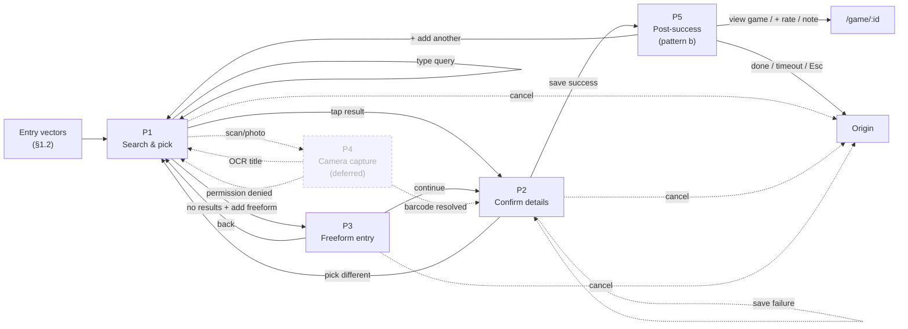

# Hoard — Interaction Flow

Canonical artifact from `/layers-interaction-flow` sessions. Sits above the conceptual model (which defines *what exists*) and below the surface (which defines *how it looks*). Defines the places users move through, the affordances available, the content presented, and the flow between states.

**Source dependencies:**
- Sealed conceptual model: [`docs/CONCEPTUAL_MODEL.md`](CONCEPTUAL_MODEL.md) (CM1–CM11)
- Sealed strategy: [`docs/PRODUCT_STRATEGY.md`](PRODUCT_STRATEGY.md) (S0–S14)
- Source needs: [`docs/USER_RESEARCH.md`](USER_RESEARCH.md) (N1–N12)

**Method:** Breadboarding (Ryan Singer / Shape Up). Text-based notation that forces interaction logic to be evaluated before visual design makes changes feel expensive. Each breadboard is for a particular user in a particular situation doing a particular job.

---

## Flows tracked

| Code | Flow | Anchor needs | Strategy bets | Status |
|---|---|---|---|---|
| F1 | Manual-add a game | N11, N8, N10 | B1c + B6k + B6l + B9a-c | **In progress** — Phase 1 frame |

---

## F1 — Manual-add a game

### 1.1 Job story

**Primary anchor: N11 (complete library across all owned platforms).**

> *When I have games on platforms outside current sync coverage — physical PS5 disc, Switch cart, retro cart, free Twitch Prime download, Nintendo eShop purchase, niche regional storefront — I want to add them to my library fast and without feeling like manual entry is the downgrade path, so the implicit promise of "your hoard, unified" actually holds.*

**Adjacent anchors:**
- **N8** (one game across platforms, not one-per-platform) — affects duplicate-detection UX when the user adds a game they already own on another platform
- **N10** (wishlist as planning tool, not just buying list) — affects status-default tuning when the entry vector implies "want to play later" rather than "own already"

**Strategic anchors:**
- **S7** — manual-add is first-class, not a fallback
- **S8** — wishlist accepts released-but-not-owned games (UX entry path is the gap, not the model)
- **S11** — retro / physical collection is a first-class surface, not a platform-picker entry
- **B1c** — manual-add UX overhaul (horizon-1 primary)
- **B6k** — barcode-scan capture vector (horizon-2, alternate entry)
- **B6l** — OCR-assisted capture vector (horizon-2, alternate entry)
- **B9a-c** — Wishlist as initial-status entry paths (folded into B1c)

### 1.2 Where the user starts

Multiple entry vectors all converging on the same downstream flow. **Existing vectors (live as of 2026-05-22):**

- Top-bar [+ add game] button (`DashboardDesktop`, `LibraryDesktop`) — generic entry
- Mobile header [+] icon (`LibraryMobile`) — mobile generic entry
- Library shelf empty-state CTA ("+ add your first game") — first-use entry
- Library top-bar [+ add game] — Library-context entry

**Strategy-required new vectors:**

- Top-bar Search-overlay "no results — try adding this" affordance — gap-recovery entry (N11)
- `/` keyboard shortcut from any library route — power-user entry (deferred-prior; revisit)
- Releases-page [+ wishlist] for a game already in IGDB — already works via wishlist-toggle, NOT via this modal (separate code path — see [§1.5 scope edges](#scope-edges))
- **Releases-page [+ wishlist] for a game NOT in IGDB** — wishlist deep-link entry that drops the user into this flow with `Wishlist` pre-selected as initial status (B9a)
- Search-result "+ wishlist" for any game the user doesn't already own — second wishlist entry path (B9a)
- GameDetail [+ wishlist] for not-in-library games — third wishlist entry path (B9b)
- **Barcode-scan camera launch** (B6k) — physical-capture entry, skips text-search
- **OCR-assisted** (B6l) — loose-cart-capture entry, prefills text-search field

The user is in some related task:
- Organising their library
- Building a wishlist from a list of games they've heard about
- Finishing a play session and wanting to log a game that wasn't synced
- Going through a stack of physical games they just bought / inherited / dug out of storage
- At a flea market with their phone, recording an impulse purchase

### 1.3 Success

A new `UserGame` row exists with:
- Correct `Game` reference resolved via IGDB (or, in the freeform-fallback path per §1.5, a Game row created from user-supplied data)
- Appropriate `Platform` / `RetroPlatform` binding covering the full strategy-required platform set, not just the existing 4-option list
- Appropriate `mediaType` (`DIGITAL | PHYSICAL_DISC | PHYSICAL_CART | ROM` per the conceptual model's expected enum; not yet implemented at the schema layer — see [§1.6 risks](#risks))
- `status` set by entry-vector default (Wishlist when entered via wishlist affordances; otherwise user-picked with sensible default based on context)
- For physical / retro entries: optional `condition` and `region` (collection metadata per CM2; deferred at UserGame schema layer)
- For multi-platform-owned games: graceful UX (per N8) — see [§1.5 scope edges](#scope-edges)

The user is back to where they were doing their original task, with inline or toast confirmation that the add succeeded. The game appears in the relevant shelves and counts immediately (per existing cache-invalidation pattern).

### 1.4 Type of work — redesign + significant extension

**Existing component:** [`apps/web/src/components/screens/AddGameModal.tsx`](../apps/web/src/components/screens/AddGameModal.tsx)

**Current flow (baseline 2026-05-22):**

```
Modal opens
- focus trap, Escape closes, click-outside closes
- title bar: // add game · [×]
- search field (debounced 400ms IGDB lookup, min 2 chars, "$" prompt prefix)
- results list (cover + title + developer/year, scrollable, 32×44 thumbnails)
- user taps result → selected state
- selected state header: cover + title + developer/year + [change]
- two dropdowns side-by-side:
    platform select (4 options: Nintendo / Epic / PC / Other)
    status select (all 6 statuses, defaults to Backlog)
- footer: [cancel] · [+ add to library]
- error: inline red text in footer
```

**Gaps vs strategy (the redesign targets):**

| # | Gap | Anchored in | Severity |
|---|---|---|---|
| G1 | Platform picker is 4 options; needs ~30+ retro + the 4 synced platforms (ST/PS/XB/GG) when adding physical copies + niche storefronts (Itch.io, Humble, Subscription services) | S7, S11, N11 | **Blocking S7** |
| G2 | No `mediaType` flag (digital / physical-disc / physical-cart / ROM) — required to drive detail-page state derivation (§3.4.1 in CONCEPTUAL_MODEL) | S7, CM4 | **Blocking S9** (detail-page variants) |
| G3 | No `condition` / `region` capture (collector metadata for physical/retro entries) | S11, CM2 | Deferred OK (optional fields per CM2) |
| G4 | Status default is hard-coded `Backlog`; no entry-vector tuning (Wishlist-when-entered-via-wishlist) | S8, N10, B9a-c | **Blocking B9a-c** |
| G5 | No multi-platform-ownership handling — `@@unique([userId, gameId])` throws 409 on duplicate; user gets a raw error instead of silent merge | N8 | Real UX defect — fix is server-side upsert per R4 resolution (silent merge into `playtimeByPlatform`); no UI design needed |
| G6 | No barcode / OCR alternate entry vectors | B6k, B6l | Future (horizon-2) |
| G7 | No IGDB-not-found fallback (freeform manual entry) — if the game isn't in IGDB, user is stuck | S7, N11 | Edge but real (small indies, regional editions, prototypes) |
| G8 | "Platform" label conflates `PlatformCode` (sync-capable account) with `RetroPlatform` (game's platform of ownership) — model-level distinction per CM1 not surfaced to user | CM1 ubiquitous language | UX correctness |

### 1.5 Scope edges — what's IN, what's OUT

**In scope for F1:**
- All text-search → add → confirm paths from any entry vector listed in §1.2 (incl. wishlist-deep-link and search-overlay-recovery)
- All gap fixes G1–G5 + G7–G8 above
- Empty / loading / error / success post-action states
- Conditional UI: condition + region appear only when `mediaType ∈ {PHYSICAL_DISC, PHYSICAL_CART, ROM}` (G3)
- Duplicate detection UX (G5)
- IGDB-not-found freeform fallback (G7)

**Out of scope for F1 (separate breadboards):**
- **Adding hardware** (UserHardware) — F-tbd, B12b. Different entity, different flow, different surface (Settings → Collection → Hardware OR RetroPlatform detail page CTA).
- **Remapping an existing UserGame** to a different Game — already shipped via [`RemapGameModal`](../apps/web/src/components/screens/RemapGameModal.tsx). Adjacent but distinct flow.
- **Bulk import from CSV / spreadsheet** (B6j) — different entry vector + different data shape + different confirmation pattern. Separate breadboard.
- **Barcode / OCR full breadboards** (G6 / B6k / B6l) — flagged here as alternate entry vectors but their detailed flows (camera permission, scan-and-decode UX, error states) are deferred to follow-on breadboards once F1 lands.
- **Releases-page [+ wishlist] for IGDB-known games** — already works via wishlist-toggle (`POST /api/upcoming/:igdbId/wishlist`), creates UserGame(status=Wishlist) + WishlistRelease atomically per CLAUDE.md decision #29. F1 only handles the case where the IGDB-known game *also* needs a UI to gather platform / mediaType (it currently doesn't ask).

### 1.6 Risks — dependencies on unsettled work

| # | Risk | Resolution path |
|---|---|---|
| R1 | `Game.mediaType` (and `UserGame.mediaType`?) is named in the conceptual model (CONCEPTUAL_MODEL §3.4.1) but not yet a schema column. F1's G2 fix needs a migration before the UI work is meaningful. | Schema work lands as part of B1c implementation; flagged in PRODUCT_STRATEGY §5.2 |
| R2 | `RetroPlatform` is sealed in the conceptual model (CM1) but no schema rows exist yet. Picker can't populate from an empty table. | B10a (retro platform enumeration) is the schema prerequisite. F1's mobile / desktop picker depth depends on B10a landing first OR a temporary client-side static list |
| R3 | `condition` / `region` (Condition enum, Region enum) are sealed in CM2 + §6.3 but not yet UserGame columns. G3 needs schema work. | Acknowledged as deferred per CM2; F1 can ship without G3 and add condition/region later |
| R4 | ~~Multi-platform-ownership uniqueness constraint doesn't accommodate "I own this on PS5 AND Switch."~~ **RESOLVED 2026-05-22 by Andrea.** The existing `playtimeByPlatform` JSON shape already encodes multi-platform ownership via key-multiplicity ([`GameDetailDesktop.tsx:113`](../apps/web/src/components/screens/GameDetailDesktop.tsx#L113) derives "OWNED ON" from `Object.entries(playtimeByPlatform).filter(min !== undefined)`). Resolution: **silent merge into the existing UserGame row** — a duplicate manual-add adds a new key to `playtimeByPlatform` (with playtime undefined or 0); no modal, no question. GameDetail's "owned on" section auto-reflects the new platform. Single open sub-question deferred to Phase 4: how does silent-merge handle a status conflict between existing row and new add (e.g. existing=Wishlist + new=Owned ⇒ probably flip; existing=Owned + new=Wishlist ⇒ probably no-op + soft toast). Backend: existing `addManualGame` endpoint needs to upsert (merge on duplicate) instead of throwing 409. |
| R5 | The Game.coverUrl + IGDB-derived cover fall-through pattern works only for IGDB-known games. Freeform-fallback (G7) needs a default cover treatment (placeholder vs. user-uploaded vs. text-only). | Decision in Phase 4 — depends on whether freeform is rare enough to accept placeholder-only |

---

### 2. Places (Phase 2)

Five conceptual places. The first three are *inside the flow*; P4 is *deferred* (alternate entry vector handled by follow-on breadboards); P5 is *exit*.

**Place-naming principle:** descriptive + user-meaningful + decoupled from current visual treatment (modal vs sheet vs full-screen is Phase 3+ territory).

#### P1 — Search & pick

The user has triggered manual-add and is locating the game. One conceptual place with four sub-states.

- **Sub-state: empty** — the surface has just opened; no query yet
- **Sub-state: searching** — query entered, debounce / IGDB fetch in flight
- **Sub-state: results** — IGDB returned matches
- **Sub-state: no-results** — IGDB returned empty for a query of ≥2 chars

The user's mental model throughout: *"I'm searching for the game I want to add."* All four sub-states share that frame, so they collapse into one place even though they look different.

#### P2 — Confirm details

A game has been selected. The user is filling in the per-ownership metadata before saving.

Always-visible affordances: platform, mediaType, status.
Conditional affordances: condition + region (only when `mediaType ∈ {PHYSICAL_DISC, PHYSICAL_CART, ROM}` — folds in G3 once schema lands).

Inbound from: P1 (picked a result), P3 (freeform-confirmed), P4 (barcode resolved — future), GameDetail [+ wishlist] (for games not yet in user's library — future entry vector).

#### P3 — Freeform entry

User reached P1's no-results sub-state and chose to enter game data manually. Resolves G7 (IGDB-not-found fallback).

Fields: title (required), developer (optional), year (optional), cover URL or upload (optional).

Why separate from P2 (not a sub-state):
- Different data shape — freeform Game fields vs. IGDB-derived Game reference
- Different mental model — *"I'm describing this thing"* vs. *"I'm picking metadata for the thing I found"*
- Different cancel path — P3 cancel returns to P1; P2 cancel from a P3-sourced game might either return to P3 or P1 depending on intent

Outbound: continues to P2 with the freeform Game data carried forward.

#### P4 — Camera capture *(deferred — F1 wires the entry vectors only)*

For B6k (barcode) and B6l (OCR) entry vectors. Camera launches; barcode-detection or OCR runs; resolution arrives at P1 (with prefilled query for OCR), P2 (with selected game for a barcode hit), or P1 no-results (for a barcode that doesn't resolve).

Flagged here so F1's other places anticipate the camera-arrival inbound edges. Detailed flow (permission grants, capture UX, scan retry, OCR confidence, abort) lives in the follow-on B6k / B6l breadboards.

#### P5 — Origin (post-success)

User is back wherever they triggered from (Library / Dashboard / Releases / GameDetail / Search-overlay / etc.) with:
- Confirmation that the add succeeded (toast or inline marker)
- The new UserGame visible in shelves / counts immediately (cache invalidation per existing pattern)

The user has NO further flow obligations. The flow is complete.

Open sub-state question (deferred to Phase 3 affordance design):

| Variant | Behavior |
|---|---|
| **(a) Modal closes immediately, toast at P5** | Standard pattern; clean exit; one fewer click |
| **(b) Modal stays open with "// added — [view] [add another] [done]"** | Friendlier for bulk-add scenarios (S7 first-class manual-add use case: "stack of physical games I just bought"); auto-closes on user action or short timeout |

Leaning (b) for the multi-item collector use case but real decision in Phase 3.

#### Connections to places elsewhere in the product

These are NOT part of F1's flow but are connected:

- **Releases page [+ wishlist]** for IGDB-known games — uses its own endpoint (`POST /api/upcoming/:igdbId/wishlist`), bypasses this flow entirely per §1.5
- **GameDetail** — possible post-success deep-link target ("view the game you just added"); also a future inbound entry vector (GameDetail [+ wishlist] for non-library games per B9b)
- **Library shelves** — common return destination (P5 origin)
- **Top-bar Search overlay** — entry vector via "no results in your library — try adding this"

---

### 3. Affordances and connections (Phase 3)

**Cross-cutting: entry intent.** Every entry vector in §1.2 carries an `intent` flag, threaded through the flow:
- `intent='own'` (default) — user is adding something they own; status default at P2 = `Backlog`; save CTA = `[+ add to library]`
- `intent='wishlist'` — user is adding something they want; status default at P2 = `Wishlist`; save CTA = `[+ add to wishlist]`

Entry vectors that carry `intent='wishlist'`: Search-overlay "no results — wishlist this" (future), Releases-page [+ wishlist] for non-IGDB games (future, B9a), GameDetail [+ wishlist] for non-library games (future, B9b), top-bar search-overlay "+ wishlist" affordance on any non-library result (future, B9c).

All other entry vectors default to `intent='own'`. Intent is overridable at P2 (user can change the status picker).

#### P1 — Search & pick

```
P1 — Search & pick
[ content: search field with $ prefix · placeholder "search IGDB by title…" · entry-vector affordances ]

  affordances always available:
  - type query (≥2 chars)                       → P1 searching → (results | no-results)
  - clear query                                 → P1 empty
  - [scan barcode]                              → P4 (deferred)         (visible when camera available)
  - [photo of label]                            → P4 (deferred)         (visible when camera available)
  - [cancel] / Esc / click backdrop             → P5 origin (no save)

  in results sub-state, per result:
  - tap a result                                → P2 (selectedGame=result, intent preserved)

  in no-results sub-state (query ≥ 2 chars, results empty, not searching):
  - [+ add freeform "{query}"]                  → P3 (prefillTitle=query, intent preserved)

  sub-states (visual variants of the same place):
  - empty       — search field present, nothing else
  - searching   — debouncing or fetch in flight, "…" indicator
  - results     — list of IGDB matches (cover · title · developer · year)
  - no-results  — "no results for {query}" message + [+ add freeform] affordance
```

#### P2 — Confirm details

```
P2 — Confirm details
[ content: selected-game summary + per-ownership pickers + save CTA ]

  inbound:
  - from P1 (result selected)                   → carries Game from IGDB, intent
  - from P3 (freeform-confirmed)                → carries Game from freeform input, intent
  - from P4 barcode resolution (future)         → carries Game from barcode lookup, intent
  - from GameDetail [+ wishlist] (future, B9b)  → carries Game (already known), intent='wishlist'

  game summary content:
  - cover + title + developer + year (read-only display)
  - [pick different]                             → P1 (preserves query, drops selectedGame)
                                                  (renamed from [change] per OQ-F1-10 to disambiguate
                                                   from GameDetail's heavier [remap] action;
                                                   hidden when source = GameDetail B9b — there's
                                                   nothing to pick different from)

  primary affordance (status — visually prominent per Stash-audit-informed lock 2026-05-22):
  - status picker                                6 options; default = (intent=wishlist ? Wishlist : Backlog)
                                                 rendered as the primary question at the top of P2 content,
                                                 mapping to the user's mental model "where am I putting this?"

  always-visible secondary affordances:
  - platform picker                              required; see §3.1 below for the picker's own structure
  - mediaType picker                            required; depends on R1 (schema gap)

  conditional affordances:
  - condition picker                            visible when mediaType ∈ {PHYSICAL_DISC, PHYSICAL_CART, ROM}; depends on R3
  - region picker                                visible when mediaType ∈ {PHYSICAL_DISC, PHYSICAL_CART, ROM}; depends on R3

  optional details (collapsible — Stash "add+" pattern, per Q1 lock 2026-05-22):
  - [+ more details ▼]                          collapsed by default; expands to reveal:

    in F1 (ships with the flow):
    - manual playtime (hours + minutes inputs)   addresses S7 promise — without this, manual-add games
                                                 forever show "playtime: —" while synced games show real
                                                 hours, contradicting "manual-add is first-class"
                                                 Schema: write a value (instead of undefined) into the
                                                 picked platform's key in playtimeByPlatform JSON
                                                 Rationale survives the "fake precision" critique because
                                                 hours-played is a measurable real-world quantity that
                                                 users routinely estimate; estimation noise is small
                                                 relative to the value of having any data at all.

    architectural slot locked in F1, implementation DEFERRED (per Andrea 2026-05-22 — placement decided
    now so the panel structure doesn't need rework when these land):
    - times beaten (− [N] + stepper)             survives the "fake precision" critique because
                                                 completion-count is countable and measurable — "I beat
                                                 Pokemon Red 3 times" is real data the user actually knows.
                                                 Collector-relevant (replay collectors, achievement hunters).
                                                 Schema TBD when implementation lands — two options:
                                                 (a) simple `UserGame.completionsCount: Int?` column;
                                                 (b) Session/Play-log entries with per-completion timestamps.
                                                 Decision deferred to the implementation phase; (a) is the
                                                 minimal viable shape, (b) is the richer shape that opens
                                                 future per-session features (date range, etc.).
                                                 Bundled with the CM12 amendment pass.

    ~~manual advancement (% slider or stepper)~~  **REJECTED 2026-05-22 (Andrea's pushback).** Reason:
                                                 manual percentage implies measurement against a 100%
                                                 that's undefined for most games (especially retro —
                                                 Pokemon Red has no objective "100%"). Whatever value
                                                 the user picks is fake precision — looks like sync data,
                                                 reads as honest, isn't. Contradicts N3 (liveness as
                                                 credibility) and N4 (scope invariant). The use case
                                                 (memory hook for "where am I in the game") is already
                                                 served by the existing notes field + the status enum
                                                 (Backlog → Playing → Completed). The S7 "trophies: —"
                                                 visual downgrade is a surface-layer problem fixed by
                                                 GameDetail display logic (hide cleanly when no data,
                                                 or label "manual entry · no progress tracked"), NOT
                                                 by adding a column the user has to lie into.

  footer:
  - [+ add to library] / [+ add to wishlist]    label by intent; disabled until required fields valid
                                                → on success → P5 (post-success summary)
                                                → on validation fail → stay in P2 + inline marker
                                                → on server fail → stay in P2 + [retry] affordance + inline marker
                                                → on auth fail (401) → /login (existing pattern)
  - [cancel] / Esc / click backdrop             → P5 origin (no save, no discard-confirm)
```

##### §3.1 — Platform picker structure

The single biggest design surface in P2. Currently 4 options; needs to span:

1. **Sync-capable digital platforms** — Steam · PSN · Xbox · GOG · Nintendo eShop · Epic · GOG Galaxy *(per PlatformCode + future expansion)*
2. **Niche / no-sync storefronts** — Itch.io · Humble Bundle · Microsoft Store (PC) · Game Pass for PC · Twitch / Prime Gaming · Free
3. **Physical / retro platforms** — pulls from `RetroPlatform` reference data (NES · SNES · Game Boy · Genesis · PS1 · etc., ~30+ entries per CM1 / B10a). Depends on R2 (RetroPlatform rows must exist before this picker can populate).

Picker structure — *two-stage, IGDB-aware* (locked per OQ-F1-1 + OQ-F1-9 resolutions):
- **Stage 1: "what kind of source?"** — three coarse buckets (Digital · Physical · Retro). When the user just picked an IGDB result in P1, the picker pre-opens the bucket matching IGDB's first reported platform for that game (e.g. Pokemon Red → IGDB reports Game Boy first → Retro bucket pre-opens).
- **Stage 2: pick within bucket** — within-bucket list, type-to-filter. Three pin sections, top to bottom:
  1. **IGDB-suggested for this game** — platforms IGDB reports for the selected Game, in IGDB's order (e.g. Game Boy · Game Boy Color · Wii Virtual Console for Pokemon Red)
  2. **Recently-used by this user** — bulk-add collector affordance ("stack of SNES carts" stays at top after first add)
  3. **Full alphabetical list** — fallback enumeration of all platforms in this bucket
- **"Other / freeform platform" affordance** — at the bottom of every stage-2 list. Tap → reveals a free-text input + label save. The free-text label is stored on UserGame (separate column or JSON metadata); future canonical entity migration possible per OQ-F1-8 resolution.

##### §3.2 — Save outcomes + status-conflict matrix

Backend behavior on save — updated per **CM12** ([CONCEPTUAL_MODEL §3.4.2](CONCEPTUAL_MODEL.md)) 2026-05-22: per-game `status` + per-platform `playtimeByPlatform` (owned) + per-platform `wishlistedPlatforms` (wished) coexist on one UserGame row.

| Existing state | New add intent + platform | Server behavior | UX message |
|---|---|---|---|
| No existing UserGame | own + P | Create UserGame; set status; add P to playtimeByPlatform | `// added · {P} · {status}` |
| No existing UserGame | wishlist + P | Create UserGame with status=Wishlist; add P to wishlistedPlatforms | `// wishlisted · {P}` |
| Existing, P already in playtimeByPlatform | own + P | No-op (game already owned on P) | `// already owned on {P}` (soft) |
| Existing, P not yet in playtimeByPlatform | own + P | Add P to playtimeByPlatform | `// added {P} to your platforms` |
| Existing, P already in playtimeByPlatform | **wishlist + P** | **Refuse** — same platform, mutually exclusive states. P stays in playtimeByPlatform. | `// you already own this on {P} — wishlisting the same platform doesn't apply` |
| **Existing, owned on PS5, P not yet anywhere (GTA case)** | **wishlist + PC** | **Add PC to wishlistedPlatforms; status stays as-is.** Honors CM12 — per-game status + per-platform wishlist. | `// wishlisted on PC (you own it on PS5)` |
| Existing, P already in wishlistedPlatforms | own + P | **Status logic:** if global status=Wishlist AND wishlistedPlatforms is about to be empty after removing P, flip status to user's chosen status. Always: remove P from wishlistedPlatforms, add P to playtimeByPlatform. | `// you got it! moved {P} from wishlist to owned` (warm copy — Hoard recognizes a fulfilled wishlist) |
| Existing, P already in wishlistedPlatforms | wishlist + P | No-op | `// already wishlisted on {P}` (soft) |
| Existing, ANY state | wishlist + Q (Q not in either collection) | Add Q to wishlistedPlatforms; status untouched | `// wishlisted on {Q}` (if global status=Wishlist) OR `// wishlisted on {Q} (you own it on {owned-platforms})` (if global status ≠ Wishlist) |

**OQ-F1-2 RESOLVED via CM12** — replaces the earlier "refuse with info" lock. The GTA case (own on PS5, wishlist on PC) is now a clean success path. The honest refuse case narrows to "wishlist the same platform you already own" — a tautological intent that genuinely doesn't make sense.

Wishlist-shelf visibility on save: a game appears on the Wishlist shelf if `status='Wishlist'` OR `wishlistedPlatforms.length > 0`. Per CM12, the GTA case (owned + per-platform wishlist) appears on BOTH the global-status shelf AND the Wishlist shelf.

#### P3 — Freeform entry

```
P3 — Freeform entry
[ content: a small form for describing a game IGDB doesn't have ]

  inbound:
  - from P1 no-results sub-state               → carries prefillTitle=query, intent

  affordances:
  - title field                                  required, prefilled from P1 query
  - developer field                              optional
  - year field                                   optional, validated as 4-digit YYYY in 1970–2030
  - cover URL field                              optional, accepts URL paste (file upload deferred)
  - [continue]                                   disabled until title non-empty
                                                → P2 (carries freeform Game data, intent)
  - [back]                                       → P1 (returns to no-results sub-state, query preserved, freeform fields dropped)
  - [cancel] / Esc / click backdrop             → P5 origin (no save, no discard-confirm)

  validation:
  - title required, non-whitespace
  - year (if entered) — 4 digits, 1970–2030 range
  - cover URL (if entered) — validated as plausible URL pattern
  - all validations are soft (inline message); no validation runs until [continue] tap
```

#### P4 — Camera capture *(deferred — F1 only wires the entry edges)*

```
P4 — Camera capture (deferred — follow-on breadboard)
  outbound edges that F1 must anticipate:
  - barcode resolved to one game                 → P2 (selectedGame=resolved, intent='own', mediaType prefilled from barcode bucket)
  - barcode resolved to multiple games           → P1 results sub-state with the candidates listed
  - barcode not resolved                         → P1 no-results sub-state with "// barcode not recognised" + manual-search hint
  - OCR captured title                            → P1 with prefillQuery=ocr-output (searching state)
  - camera permission denied / camera unavailable → fall back to P1 empty state + inline notice
```

#### P5 — Origin (post-success per Pattern (b))

```
P5 — Origin (post-success — Pattern (b) per 2026-05-22 lock)
[ content: inline summary "// added {title} · {platform} · {status}" + three CTAs ]

  affordances:
  - [view game]                                  → navigate to /game/{userGameId}; modal closes
  - [+ rate / note]                              → navigate to /game/{userGameId}?focus=notes
                                                 → modal closes
                                                 (deep-link reuses existing post-8 PR A pattern;
                                                  surfaces optional rating + free-text annotation
                                                  at the moment-of-intentionality without F1
                                                  having to build a rating subsystem itself —
                                                  Stash-audit-informed lock 2026-05-22)
  - [add another]                                → P1 empty (preserves entry intent + platform pick
                                                   per OQ-F1-4 resolution below)
  - [done] / [×]                                 → close modal; user is back at origin
  - 3s auto-close timeout (no user action)       → close modal; user is back at origin
  - Esc / click outside                          → close modal

  context preserved across [add another]:
  - entry intent (own / wishlist)
  - platform pick (visible as a "pinned" indicator so the user knows it carries; tappable to unpin)
  - (not preserved) selected game, freeform input, status, mediaType, optional-details
  rationale: collector use case "stack of SNES carts I just bought" — pinning platform saves
  ~15 clicks across a 30-item bulk-add session. Mixed-platform users can tap unpin.
```

---

---

### 4. Walking the flow (Phase 4)

Narrating the user's experience through happy paths, then walking every edge. Each happy-path archetype represents a different user-situation; one walked in full, others summarized to show the variants converge on the same skeleton.

#### 4.1 Happy paths — four archetypes

**HP1 — First manual-add from Library empty-state** *(walked in full)*

> *I'm a friendly-fire-cohort user who just signed up. I have a stack of physical Switch games I want to log before connecting any sync platform. I land at `/library` and see an empty state.*

| Step | Place / state | What happens |
|---|---|---|
| 1 | `/library` empty | User sees `// nothing here yet — connect a platform or add games manually` with two CTAs: `[connect a platform]` `[+ add your first game]` |
| 2 | Tap `[+ add your first game]` | Modal opens. **Inbound to P1** with `intent='own'`, entry vector=library-empty-state |
| 3 | **P1 — empty sub-state** | Search field focused with `$` prefix, placeholder `search IGDB by title…`. Below: `[scan barcode]` `[photo of label]` (visible only if camera available — see OQ-F1-3 resolution below). Modal header: `// add game` + `[×]` |
| 4 | Type `Pokemon Red` | P1 transitions to **searching** sub-state on the 2nd char; `…` indicator appears in the field |
| 5 | After 400ms debounce + fetch | P1 transitions to **results** sub-state. Top match: `Pokémon Red Version` · Game Freak · 1996, with cover |
| 6 | Tap the result | **Inbound to P2** with `selectedGame=PokemonRed`, `intent='own'` |
| 7 | **P2 content renders** | Status picker at the top (primary): defaults to `Backlog`, 6 options visible. Below: game summary card (cover + title + dev + year + `[change]`). Below: platform picker (two-stage per OQ-F1-1 resolution). Below: mediaType picker (depends on R1 — see ship-order note). `[+ more details ▼]` collapsed at bottom. Footer: `[+ add to library]` (disabled until required fields valid) + `[cancel]` |
| 8 | Pick platform | Two-stage picker: tap **Retro** bucket → within-Retro list → pick **Game Boy** (or whatever the user owns the game on — for Pokemon Red it's Game Boy. Hardware platform is also Game Boy, not Switch. User correction implied: they meant Game Boy not Switch.) |
| 9 | Pick mediaType | `Physical cart` (when R1 ships) |
| 10 | Conditional pickers appear | `condition` (LOOSE / CIB / SEALED / etc.) + `region` (NTSC-U / NTSC-J / PAL / OTHER) become visible because mediaType ∈ physical set. User picks LOOSE + PAL |
| 11 | Tap `[+ add to library]` | P2 transitions to **saving** state — button shows `[saving…]`, form fields disabled |
| 12 | Server upsert | `Game` upserted (IGDB cache hit or fresh fetch); `UserGame` created with status=Backlog, playtimeByPlatform={GB: undefined}, condition=LOOSE, region=PAL, mediaType=PHYSICAL_CART. Cache invalidated for `games:`, `shelves:`, `gameCounts`, `dashboard` |
| 13 | Server returns 201 | **Transition to P5 post-success** (pattern b) |
| 14 | **P5 — post-success summary** | Inline: `// added · Pokémon Red Version · Game Boy · Backlog`. Three CTAs: `[view game]` `[+ add another]` `[done]`. 3s auto-close timer starts |
| 15 | Tap `[done]` (or wait for timeout, or click outside) | Modal closes; user is back at `/library` |
| 16 | Library shelves refresh | SWR revalidates from cache invalidation; Backlog shelf now shows Pokémon Red with cover. Sidebar shelf-count badges update |

**HP2 — Bulk-add via Library top-bar `[+ add game]`** *(summarised — same skeleton as HP1 with platform-pinning across [+ add another])*

User has 10 SNES carts to log. First add: HP1 path, picks SNES + Physical cart + LOOSE + PAL + Backlog, saves. At P5 taps `[+ add another]` instead of `[done]`. Returns to **P1 empty** with the platform pin visible (`// pinned: SNES · [unpin]`). Repeats 9 more times — each iteration is just `type title → pick IGDB result → save` (status defaults from prior iteration, platform pre-pinned). Saves ~15 clicks vs unpinned.

**HP3 — Wishlist deep-link from search overlay** *(summarised — entry intent variant)*

User types "Silksong" in the top-bar Search overlay. No matches in their library. Overlay shows `// nothing in your library · + wishlist this`. User taps it → modal opens with `intent='wishlist'`, `prefillQuery='Silksong'`, P1 immediately in results sub-state with IGDB matches. User picks the result → P2 with status pre-set to `Wishlist`, save CTA reads `[+ add to wishlist]`. On save, backend creates UserGame(status=Wishlist) AND (if IGDB shows future release date) creates WishlistRelease atomically per CLAUDE.md decision #29.

**HP4 — Freeform-fallback for non-IGDB game** *(summarised — different inbound path to P2)*

User searches for an obscure regional indie. P1 enters no-results sub-state with `[+ add freeform "obscureindie"]`. Tap → **P3** with prefillTitle. User fills title + developer + year + (optional) cover URL → `[continue]` → P2 with freeform Game data (no IGDB id). P2 [change] affordance is hidden (no IGDB result to change to; user goes back via [back]→ P3 → P1 if they want to redo). Save proceeds as HP1.

#### 4.2 Edge cases by place

**P1 edges:**

| Edge | Behavior |
|---|---|
| Camera unavailable on desktop | `[scan barcode]` / `[photo of label]` affordances hidden entirely (no tooltip). Detected via `navigator.mediaDevices` capability check — **OQ-F1-3 resolved.** |
| Typing fast → debounce | In-flight fetch cancelled; new fetch debounced; only the latest query's results render. Existing pattern. |
| IGDB API timeout / 5xx | Inline marker in P1 results area: `// IGDB unreachable — try again or [+ add freeform "{query}"]`. Same affordance set as no-results sub-state but with the network reason surfaced. Retry triggers the debounce again. |
| Query <2 chars | Empty sub-state (no fetch). Standard. |
| Cancel (Esc / `[×]` / backdrop click) | → P5 origin (no save). No discard-confirm — nothing to discard. |

**P2 edges:**

| Edge | Behavior |
|---|---|
| **mediaType picker (R1 dep) not yet shipped** | F1's first PR ships with the picker hidden / disabled depending on schema state; G2 fix is landed when R1 lands. Conditional condition/region pickers (R3) follow the same pattern — gated by the schema migration that adds the columns. **Ship-order note:** F1 PR sequence is (1) status-first layout + platform picker overhaul + IGDB-resolved happy path; (2) R1 migration + mediaType picker + condition/region gated on R3; (3) [+ more details] panel with manual playtime; (4) freeform-fallback (P3). |
| **RetroPlatform rows empty (R2 dep) not yet shipped** | Platform picker's Retro bucket shows `// retro platforms coming soon — manual entry for now` with a freeform string fallback (current behavior). Retro section ships when B10a lands. |
| Save validation failure | Required field missing → inline red marker in P2 footer, field highlighted, form stays. Status always defaults so can't be empty; platform always required. |
| Save 5xx / network error | Inline red marker `// couldn't save — try again` + `[retry]` button. Form data preserved. |
| Save 401 (session expired) | Modal closes; redirect to `/login` per existing app-wide pattern. |
| Save duplicate (existing UserGame for same gameId, owned + owned case) | Backend upserts per R4 silent-merge resolution. UX message at P5: `// already on {existing-platforms} · added {new-platform}` |
| Save duplicate, existing=Wishlist + new=Owned | Backend flips status from Wishlist to user-picked status; merges platform. UX message: `// moved from wishlist to {status} · {platform}` |
| Save duplicate, existing=Owned + new=Wishlist (OQ-F1-2) | **SUPERSEDED by CM12 2026-05-22 (Andrea's PLATFORMS-section proposal).** New behavior: if the wishlisted platform is DIFFERENT from the owned platform (the GTA case: own PS5, wishlist PC), add the new platform to `wishlistedPlatforms`. Status stays as-is. UX: `// wishlisted on PC (you own it on PS5)`. If the wishlisted platform is the SAME as the owned platform, refuse with `// you already own this on {P} — wishlisting the same platform doesn't apply`. Honest refuse narrows to the only case where it's genuinely tautological. See §3.2 conflict matrix for the full state combinations. |
| Save duplicate, existing=Wishlist + new=Wishlist | Backend silently merges platform key. UX message: `// already wishlisted · added {new-platform}` |
| [pick different] tap (IGDB-sourced game) | → P1 with query preserved, selectedGame dropped. User picks a different result quickly. |
| [pick different] tap (freeform-sourced game) | → P3 with freeform data preserved (one exception to the otherwise-drop-everything rule — freeform input is meaningful and tedious to retype). |
| Cancel (Esc / `[×]` / backdrop click) | → P5 origin (no save, no discard-confirm). |

**P3 edges:**

| Edge | Behavior |
|---|---|
| Title empty / whitespace-only | `[continue]` disabled. |
| Year non-numeric or out-of-range (1970–2030) | Soft inline marker on field, only runs on `[continue]` tap. |
| Cover URL malformed | Soft inline marker. URL paste only in v1 — file upload deferred (Vercel Blob / S3 infra cost). |
| `[back]` | → P1 no-results sub-state, query preserved, freeform fields dropped. |
| Cancel (Esc / `[×]` / backdrop click) | → P5 origin (no save, no discard-confirm — small enough form to lose). |

**P5 edges:**

| Edge | Behavior |
|---|---|
| 3s auto-close, no user action | Modal closes silently. Cache already invalidated server-side at save; library shelves already reflect the new entry. |
| `[+ add another]` | → P1 empty. Preserves: intent + platform pin (with visible `[unpin]`). Drops: selectedGame, freeform, status, mediaType, [+ more details] values. |
| `[+ rate / note]` | navigates to `/game/{userGameId}?focus=notes` — modal closes. Uses existing post-8 PR A focus-on-notes pattern. |
| `[view game]` | navigates to `/game/{userGameId}` — modal closes. |
| Wishlist case (HP3 variant) — backend also created WishlistRelease for future-release IGDB games | P5 summary copy adapts: `// added to wishlist · {title} · {platform} · counting down [N] days`. Affordance set unchanged. |

#### 4.3 Open question resolutions surfaced through walkthrough

| Code | Resolution |
|---|---|
| ~~**OQ-F1-1**~~ | ~~Two-stage platform picker vs. flat searchable~~ — **RESOLVED → two-stage with smart defaults.** Stage 1: three coarse buckets (Digital · Physical · Retro), Digital opened by default. Stage 2: within-bucket list, type-to-filter, recently-used pinned at top (bulk-add collector use case). Rationale: maps to user cognitive structure (you know if you're adding digital or physical), avoids 50-option overwhelm, recently-used pinning serves the bulk-add S7 use case. **Testable** — if usability signals push back, fall back to a flat list with grouped headers; the data structure supports both renderings. |
| ~~**OQ-F1-2**~~ | ~~existing=Owned + new=Wishlist status-conflict~~ — **SUPERSEDED by CM12 2026-05-22.** Initial Phase 4 resolution was Option (i) refuse-with-info; Andrea proposed the PLATFORMS-section rename (CM12) that solves the underlying model problem: per-game status + per-platform wishlist as distinct collections. The GTA case (own PS5, wishlist PC) becomes a clean success path. Refuse narrows to wishlist-same-platform-already-owned (tautological). See §3.2 conflict matrix + CONCEPTUAL_MODEL §3.4.2 + CM12. |
| ~~**OQ-F1-3**~~ | ~~Camera affordance visibility on desktop~~ — **RESOLVED → browser-capability-conditional rendering.** `navigator.mediaDevices.getUserMedia` capability check at modal mount. Affordances hidden entirely when no camera; no tooltip, no "coming soon" copy. Avoid UI bloat for desktop users. |
| ~~**OQ-F1-4**~~ | ~~[+ add another] reset granularity~~ — already RESOLVED 2026-05-22 (preserve platform + intent across iterations). |

#### 4.4 New questions surfaced during walkthrough

| Code | Question | Resolves in |
|---|---|---|
| **OQ-F1-5** | Wishlist + future-release IGDB game → backend should create both `UserGame(Wishlist)` AND `WishlistRelease` atomically per existing CLAUDE.md decision #29. Implementation detail flagged here so the manual-add backend route doesn't accidentally skip the WishlistRelease creation. | Implementation phase — already a known pattern, just needs to be wired up. |
| **OQ-F1-6** | Cover URL paste in P3 → no upload path in v1. If user has an image file (not a URL), they can't add a cover. Workaround: paste an Imgur URL. Accept for v1; revisit when file-upload infrastructure exists for other features (screenshots per Stash-bundle item 6). | Future infra workstream. |
| **OQ-F1-7** | `[+ rate / note]` deep-link assumes `/game/:userGameId?focus=notes` exists. Verified to exist per post-8 PR A; no new work needed. | Resolved (existing pattern). |

#### 4.5 Ship-order recommendation

F1 is too big to ship in one PR. Suggested PR sequence:

1. **F1-PR1 — Status-first layout + platform picker overhaul + IGDB happy path.** Closes G1 + G4 + G8. Ships the layout shift, the 50-option two-stage picker, and the entry-intent threading. mediaType / condition / region not yet wired (gated on schema work).
2. **F1-PR2 — mediaType + condition + region.** Closes G2 + G3. Includes the schema migration (R1 + R3) and the conditional UI logic in P2.
3. **F1-PR3 — `[+ more details]` panel with manual playtime.** Closes the S7 "playtime: —" downgrade. Times-beaten slot reserved but not implemented.
4. **F1-PR4 — Freeform-fallback (P3).** Closes G7.
5. **F1-PR5 — Backend upsert + status-conflict matrix.** Closes G5 + OQ-F1-2 backend behavior. Wishlist-creates-WishlistRelease wiring (OQ-F1-5).
6. **F1-PR6 — P5 pattern (b) summary + platform pinning + `[+ rate / note]` deep-link.** Closes the post-success UX layer.

PR1 is the minimum-shippable subset that delivers a noticeably better add-game UX. PR2–6 ship incrementally. Each PR is independently shippable; none depends on F2+ work.

---

---

### 5. Challenging the flow (Phase 5)

Six checks against the breadboard before consolidation. Each surfaces either a confirmed-good or a real gap to fix.

#### 5.1 Abandonment-risk audit

Where would a real user give up before saving?

| Risk point | Severity | Mitigation in current design | Action |
|---|---|---|---|
| Platform picker overwhelm (50 options) | Medium | Two-stage Digital / Physical / Retro buckets; recently-used pinned within Stage 2; type-to-filter | ✓ Sufficient |
| User's platform missing from the list | Medium | Niche/storefronts bucket includes Itch.io / Humble / etc.; freeform fallback (P3) catches catalog-side gaps but not platform-side gaps | **New OQ-F1-8** — what happens if user wants to add a game on a platform Hoard hasn't enumerated? Two options: (a) "Other" generic option in each bucket with free-text label, (b) GitHub-issue-style "request platform" link. Defer to Phase 6 challenge; lean toward (a) "Other / freeform platform" for v1 |
| mediaType ambiguity ("Pokemon Red on Game Boy — ROM or PHYSICAL_CART?") | Low-medium | Micro-copy on each option: `digital · downloaded purchase`, `physical disc · BluRay / DVD / cart with case`, `physical cart · standalone cart`, `ROM · digital file emulated` | Folds into F1-PR2 implementation polish |
| No-results → P3 freeform fallback discoverability | Medium | `[+ add freeform "{query}"]` affordance prominent in no-results sub-state | ✓ Sufficient if the affordance is visually weighty (not buried in small grey text) |
| IGDB slowness / timeout | Medium | Searching indicator visible; timeout falls into no-results-with-reason ("// IGDB unreachable") + retry | ✓ Sufficient |
| Saving spinner with no progress signal | Low | Standard saving state; backend is fast (<500ms typical) | ✓ Sufficient |
| Required-field validation hidden / unclear | Medium | Inline marker on field + footer-level message; save button disabled until valid | ✓ Sufficient if disabled-button state is visible (faded ≠ invisible) |
| Camera permission denied (B6k / B6l, deferred) | N/A | Falls back to P1 empty with notice — flagged in P4 deferred-breadboard | Not F1 concern |

Net: no critical abandonment risks. One new OQ-F1-8 surfaced (platform-not-enumerated affordance).

#### 5.2 Missing-actions audit

Actions a real user would reasonably expect that the flow doesn't offer:

| Expected action | Decision |
|---|---|
| Save without picking any platform ("I have this somewhere") | **Reject** — platform is required. Hoard's identity is precise cataloguing; "somewhere" doesn't fit. The Other/freeform-platform affordance (OQ-F1-8) catches the case where the user has a specific platform Hoard doesn't list. |
| Add multiple platforms at once ("I own GTA on PS5 AND Switch in one tap") | **Defer** — current flow requires two adds with the R4 silent-merge behavior making the second add seamless. Multi-pick at picker level is a UX optimization, not v1. |
| Bulk paste-text ("Pokemon Red, Zelda Link's Awakening, Mario Land" → three adds) | **Defer to B6j (CSV bulk import)** — different data shape, different flow. |
| Inline-edit after save without leaving the modal | **Reject** — modal is "add", not "edit". P5 `[view game]` deep-link is the bridge; GameDetail is the edit surface. |
| Discard-confirm when user has typed freeform metadata (P3) | **Reject** — freeform form is small (~4 fields); accidental Esc loss is acceptable. Adding a confirm dialog every cancel would feel heavy. |
| **Suggested platforms based on IGDB metadata** | **Accept — new feature, fold into F1-PR1.** When user picks an IGDB result, the IGDB metadata includes `platforms[]` (Game Boy, GBC, Wii VC for Pokemon Red). The picker can pre-open the right bucket AND pin those platforms at top of Stage 2. Real UX win at low cost — IGDB data is already fetched. **OQ-F1-9** added below. |
| Quick `+ wishlist` chip on result row in P1 (intent override at pick-time) | **Defer** — entry intent is already set correctly by entry vector; the rare case of user-changes-mind-mid-flow is served by the status picker in P2. |
| Soft-undo on save ("Oops, didn't mean to add that — undo") | **Defer** — P5 has [view game] which leads to GameDetail's delete affordance. A toast-level undo is nice-to-have but not v1; cleanup is one extra tap via GameDetail. |

Net: one new accepted feature (IGDB-suggested platforms — OQ-F1-9) folds into F1-PR1.

#### 5.3 Vocabulary consistency check

Cross-checking flow language against the conceptual model's ubiquitous language ([CONCEPTUAL_MODEL §6](CONCEPTUAL_MODEL.md)).

| Flow term | Model term | Status |
|---|---|---|
| "library" / "wishlist shelf" | Library / Shelf (§6.1) | ✓ matches |
| "PLATFORMS" section heading | PLATFORMS section (CM12) | ✓ now matches post-CM12 lock |
| "[+ add to library]" / "[+ add to wishlist]" | UserGame add action + Wishlist initial-state action (S8) | ✓ matches |
| "wishlisted" row marker | wishlistedPlatforms entry per CM12 | ✓ matches |
| Status options "Backlog / Playing / Completed / OnHold / Dropped / Wishlist" | GameStatus enum (§6.3) | ✓ all six match |
| "platform" picker label | Platform (sync-capable) + RetroPlatform (reference) per CM1 — distinction hidden from user, surfaced via the two-stage bucket structure | ✓ honest abstraction — user picks a code; backend binds to the right entity |
| "mediaType" | mediaType enum (DIGITAL / PHYSICAL_DISC / PHYSICAL_CART / ROM) per CM2 | ✓ matches |
| "condition" / "region" | Condition / Region enums (§6.3) | ✓ matches |
| `// added · {platform} · {status}` toast copy | UserGame state shorthand | ✓ honest |
| `[+ more details]` panel | (no direct model term — UI affordance only) | ✓ no conflict |

Action verbs (§6.2):
- `[+ add to library]`, `[+ add to wishlist]`, `[+ add another]` — Add verb consistent
- `[change]` (P2 → P1) — used for "change which IGDB result is selected"; distinct from `[remap]` (which is the GameDetail action for changing the underlying Game). Consider renaming to `[change selection]` or `[pick different]` to disambiguate at the surface level. **OQ-F1-10** flagged.
- `[continue]`, `[back]`, `[cancel]`, `[done]`, `[view game]`, `[+ rate / note]`, `[unpin]`, `[retry]` — all unambiguous

Net: vocabulary matches model. One small disambiguation surfaced (OQ-F1-10: `[change]` vs `[remap]`).

#### 5.4 Simpler-version check

Is there a leaner flow that serves the same job?

Three credible "simpler" alternatives considered:

1. **Single-screen flow — search + pick + save in one place, no P2.** Cost: loses the [+ more details] panel; loses the freeform-fallback path; conflates the "pick a game" job with the "describe ownership" job. **Reject** — the two-step structure honors the genuine cognitive split between "find the right Game" and "tell Hoard about this UserGame relationship."

2. **No mediaType / condition / region asks — just status + platform.** Cost: loses S7 manual-add-as-first-class (collection metadata is core for retro/physical collectors); makes Hoard look like Stash with platform extension. **Reject** — these are conditional, optional, and they're the differentiator for the collector identity (S0 + S11).

3. **Voice input for game title in P1.** Speak "Pokemon Red" → P1 results populated. Real UX win but heavy infra (Web Speech API + transcript polish + accent handling) for a niche affordance. **Defer** — interesting future enhancement, not core.

Net: current breadboard is at the right level of detail. The complexity is justified by the job story's diversity (digital + physical + retro + wishlist + bulk + freeform).

#### 5.5 Broken-objects check

For each conceptual-model object appearing in F1, are its attributes and actions available together?

| Object | Attributes shown in F1 | Actions in F1 | Other surfaces | Broken? |
|---|---|---|---|---|
| **Game** | title, developer, releaseYear, coverUrl shown in P1 results + P2 summary | select (P1 → P2), change (P2 → P1) | GameDetail (via [view game] in P5) shows hltb, achievements, full description, gallery, etc. | **Not broken** — F1 elides Game's full surface deliberately; modal stays focused; [view game] + [+ rate / note] deep-links bridge to GameDetail. |
| **UserGame** (created in this flow) | status, platform binding (→ playtimeByPlatform or wishlistedPlatforms), mediaType, condition, region, manual playtime (optional) | create (save) | GameDetail handles edit + change-status + add-note + rate + delete | **Not broken** — F1 sets a meaningful subset (the creation moment's data); the rest are GameDetail's job. P5 deep-links are the bridge. |
| **Platform / RetroPlatform** | Picked indirectly via the two-stage picker; the picker shows code + name | (pick) | Settings → Platforms shows sync-account-level config | **Not broken** — reference data; the user picks a code, doesn't manage Platform entities here. |
| **WishlistRelease** | Invisible to user in F1 | (backend creates atomically on wishlist + future-release per decision #29) | Releases page is the WishlistRelease surface | **Not broken** — implementation-detail side-channel that makes Releases work; F1 doesn't surface it intentionally. |

No broken objects.

#### 5.6 Isolated-objects check

For each model relationship, does F1 make it visible / navigable where appropriate?

| Relationship | Visible in F1? | Decision |
|---|---|---|
| User → UserGame | Implicit via auth context | ✓ correct (no need to surface) |
| UserGame → Game | P2 game summary card | ✓ visible |
| UserGame → Platform / RetroPlatform | Via the picker selection | ✓ visible |
| UserGame → WishlistRelease | Invisible | ✓ intentional — implementation-detail; users experience "I wishlisted GTA," not "I created a WishlistRelease row" |
| Game → HltbData | Invisible in F1 | ✓ intentional — GameDetail shows it |
| Game → Deals (future, S10) | Invisible in F1 | ✓ intentional — GameDetail / detail-page variants show it |
| Game → MarketplaceListing (future, S12) | Invisible in F1 | ✓ intentional — GameDetail wishlisted-physical variant shows it |
| RetroPlatform → UserHardware (CM10) | Invisible in F1 | ✓ intentional — separate flow B12, separate surface |
| Game → Series / Developer / Publisher (CM12 bundle, future) | Invisible in F1 | ✓ intentional — GameDetail lateral-nav surface (future); F1 is about creating UserGame, not exploring relationships |

No isolated objects in the model that should be visible in F1 but aren't. The intentional invisibilities are deliberate (GameDetail is the relationship-exploration surface; F1 is the creation moment).

#### 5.7 Open questions surfaced in Phase 5

| Code | Question | Resolution |
|---|---|---|
| ~~**OQ-F1-8**~~ | ~~Platform-not-enumerated affordance~~ — **RESOLVED 2026-05-22 → (a) "Other / freeform platform"** in each stage-2 bucket. Free-text label stored on UserGame for the row. Future canonical entities (e.g. when "Steam Deck" enters the Platform enum) can be migrated to from matching free-text labels via a one-time data migration. |
| ~~**OQ-F1-9**~~ | ~~IGDB-suggested platforms~~ — **RESOLVED 2026-05-22 → yes.** When user picks an IGDB result in P1, P2's picker pre-opens the bucket containing the FIRST IGDB-reported platform (Digital / Physical / Retro), and pins the IGDB-reported platforms at the top of stage-2 (above the recently-used pin section). Pure UX win; IGDB data already fetched. Folds into F1-PR1. |
| ~~**OQ-F1-10**~~ | ~~`[change]` vs `[remap]` disambiguation~~ — **RESOLVED 2026-05-22 → rename P2 button to `[pick different]`.** "Remap" stays reserved for the heavier GameDetail action of changing the underlying Game on an existing UserGame; "Pick different" is the lighter "change which IGDB result I'm about to add" action. Folds into F1-PR1. |

#### 5.8 Net assessment

The breadboard survives all six challenge passes with two confirmed enhancements and three new small open questions (OQ-F1-8, -9, -10) — none invalidating prior decisions; all three are small enough that I can lock them with your one-line yes/no.

If the three new OQs read right (or you push back), I'll lock them and roll into Phase 6 — consolidated breadboard + Mermaid flow diagram + completion.

---

---

### 6. Consolidated breadboard (Phase 6)

Final text-notation breadboard incorporating all phase 1–5 decisions. This is the **primary deliverable** of `/layers-interaction-flow F1`. The Mermaid flow diagram below (§6.2) is for orientation only — it loses content and conditional detail.

#### 6.1 Final breadboard

```
─────────────────────────────────────────────────────────────────────
F1 — Manual-add a game
Job story: see §1.1 (anchor N11; adjacent N8, N10)
─────────────────────────────────────────────────────────────────────

ENTRY VECTORS                                                            ┐
- Library top-bar [+ add game]                  intent='own'             │
- Library shelf empty-state CTA                 intent='own'             │
- DashboardDesktop [+ add game] empty CTA       intent='own'             │  All converge
- Mobile header [+] icon                        intent='own'             │  to P1 with the
- Top-bar Search-overlay "+ wishlist this"      intent='wishlist'        │  carried intent
- Releases-page [+ wishlist] for non-IGDB game  intent='wishlist'  (B9a) │
- GameDetail [+ wishlist] for non-library game  intent='wishlist'  (B9b) │
- Top-bar Search-result "+ wishlist"            intent='wishlist'  (B9c) │
- [scan barcode] / [photo of label]             intent='own' (deferred)  ┘
                                                          ↓
─────────────────────────────────────────────────────────────────────
P1 — Search & pick
[ content: search field with $ prefix · placeholder "search IGDB by title…"
           · camera affordances (visible when navigator.mediaDevices available)
           · results / no-results below ]

Sub-states: empty | searching | results | no-results

Always-available affordances:
- type query (≥2 chars)                       → searching → results | no-results
- clear query                                 → empty
- [scan barcode]      (camera-detected)       → P4 (deferred — out-of-F1)
- [photo of label]    (camera-detected)       → P4 (deferred — out-of-F1)
- [cancel] / Esc / click backdrop             → Origin (no save)

In results sub-state, per result:
- tap a result                                → P2 (selectedGame=result, intent preserved)

In no-results sub-state (query ≥2 chars, results empty, not searching):
- [+ add freeform "{query}"]                  → P3 (prefillTitle=query, intent preserved)

In searching sub-state, on IGDB timeout / 5xx:
- inline marker "// IGDB unreachable — try again or [+ add freeform]"
- [retry]                                     → searching (re-trigger debounce)
                                                          ↓
─────────────────────────────────────────────────────────────────────
P2 — Confirm details
[ content: status picker (PRIMARY, top) · game summary card ·
           platform picker (two-stage, IGDB-aware) · mediaType picker ·
           conditional condition + region pickers · [+ more details] panel ·
           save / cancel footer ]

Inbound:
- from P1 (result selected)                   carries Game from IGDB, intent
- from P3 (freeform-confirmed)                carries Game from freeform input, intent
- from P4 barcode resolution (future)         carries Game, intent='own'
- from GameDetail [+ wishlist] (future B9b)   carries Game, intent='wishlist'

Primary affordance:
- status picker (6 options)                    default = (intent=wishlist ? Wishlist : Backlog)
                                               visually primary per Stash-audit-informed lock

Game summary content (read-only):
- cover + title + developer + year
- [pick different]                            → P1 (preserves query, drops selectedGame)
                                                 (renamed from [change] per OQ-F1-10)
                                                 (hidden when source = GameDetail B9b)
                                                 (preserves freeform data when source = P3)

Always-visible secondary affordances:
- platform picker (two-stage, IGDB-aware)     required; pre-opens IGDB-suggested bucket;
                                              stage-2 pin order: IGDB-suggested, recently-used,
                                              full list; "Other / freeform platform" at bottom
- mediaType picker (4 options + micro-copy)   required when R1 ships (digital, physical disc,
                                              physical cart, ROM)

Conditional affordances (visible when mediaType ∈ {PHYSICAL_DISC, PHYSICAL_CART, ROM}):
- condition picker (5 options)                LOOSE / CIB / SEALED / REPLICA / GRADED
- region picker (4 options)                   NTSC_U / NTSC_J / PAL / OTHER

Optional collapsible panel:
- [+ more details ▼]                          expands to reveal:
  - manual playtime (hours + minutes)         writes to playtimeByPlatform JSON value
                                              (ships in F1-PR3)
  - times beaten (− [N] + stepper)            slot reserved, implementation deferred
                                              to CM12 amendment bundle

Save / cancel:
- [+ add to library] / [+ add to wishlist]    label by intent; disabled until required fields valid
                                                → on success → P5
                                                → on validation fail → stay in P2 + inline marker
                                                → on server 5xx / network → stay in P2 + [retry]
                                                → on 401 → /login (existing pattern)
- [cancel] / Esc / click backdrop             → Origin (no save, no discard-confirm)

Backend save behavior — full conflict matrix per §3.2:
- No existing UserGame                        → create with status + platform binding
- Existing + same platform, intent matches    → no-op + soft toast
- Existing + new platform, intent='own'       → add platform to playtimeByPlatform
- Existing owned-on-P5 + intent='wishlist'+PC → add PC to wishlistedPlatforms (CM12 GTA case)
- Existing wishlisted-on-PC + intent='own'+PC → status flip + remove from wishlistedPlatforms +
                                                add to playtimeByPlatform + "// you got it!" copy
- All other combinations per §3.2 matrix
                                                          ↓
─────────────────────────────────────────────────────────────────────
P3 — Freeform entry
[ content: title (required, prefilled) · developer · year · cover URL ·
           continue / back / cancel ]

Inbound:
- from P1 no-results sub-state                carries prefillTitle=query, intent

Affordances:
- title field                                  required, prefilled from P1 query
- developer field                              optional
- year field                                   optional, validated 4-digit YYYY in 1970–2030
- cover URL field                              optional, URL paste only (file upload deferred)
- [continue]                                   disabled until title non-empty
                                                → P2 (carries freeform Game data, intent)
- [back]                                       → P1 no-results sub-state, query preserved,
                                                 freeform fields dropped
- [cancel] / Esc / click backdrop             → Origin (no save)

Validation:
- title required, non-whitespace
- year (if entered) — 4 digits, 1970–2030
- cover URL (if entered) — plausible URL pattern
- soft inline; only runs on [continue] tap
                                                          ↓
─────────────────────────────────────────────────────────────────────
P4 — Camera capture                                           [DEFERRED]
[ content: live camera feed · capture / abort affordances ]
Detailed flow lives in follow-on breadboards (B6k barcode, B6l OCR).

Outbound edges F1 anticipates:
- barcode → single match                      → P2 (selectedGame=resolved, intent='own')
- barcode → multiple candidates               → P1 results with the candidates listed
- barcode → no match                          → P1 no-results + "// barcode not recognised"
- OCR captured title                          → P1 with prefillQuery=ocr-output (searching)
- permission denied / no camera               → P1 empty + inline notice
                                                          ↓
─────────────────────────────────────────────────────────────────────
P5 — Origin (post-success per Pattern (b))
[ content: inline summary "// added {title} · {platform} · {status}"
           · three CTAs · 3s auto-close timer ]

Affordances:
- [view game]                                  → /game/{userGameId}; modal closes
- [+ rate / note]                              → /game/{userGameId}?focus=notes; modal closes
                                                 (deep-link reuses post-8 PR A pattern;
                                                  surfaces optional rating + free-text
                                                  annotation at moment-of-intentionality)
- [+ add another]                              → P1 empty
                                                 preserves: intent + platform pin (with visible
                                                 "pinned" indicator + tappable [unpin])
                                                 drops: selectedGame, freeform, status,
                                                 mediaType, [+ more details] values
- [done] / [×]                                 → close modal; user back at origin
- 3s auto-close (no interaction)               → close modal; user back at origin
- Esc / click outside                          → close modal

Copy variants by state-conflict outcome:
- New UserGame                                 "// added · {title} · {platform} · {status}"
- Silent merge (already owned, new platform)   "// added {new-platform} to your platforms"
- Wishlist+future-release (decision #29)       "// added to wishlist · counting down [N] days"
- Wishlist intent on owned-P5 + new PC (GTA)   "// wishlisted on PC (you own it on PS5)"
- Wishlist-fulfilled-by-ownership-add          "// you got it! moved {P} from wishlist to owned"
- Wishlist-same-platform-as-owned (tautology)  REFUSE — see §3.2 / OQ-F1-2 superseded
─────────────────────────────────────────────────────────────────────
```

#### 6.2 Flow diagram (Mermaid `graph LR`)



Solid edges = primary flow. Dashed edges = error / deferred / cancel paths.

#### 6.3 Completion deliverables (per `/layers-interaction-flow` close-out)

| Deliverable | Location |
|---|---|
| **1. Job story** | §1.1 (N11 primary; N8 + N10 adjacent) |
| **2. Breadboard** | §6.1 above |
| **3. Flow diagram** | §6.2 above |
| **4. Open decisions** | All ten OQ-F1-* RESOLVED through phases 3–5. None outstanding for F1 itself. |
| **5. Risks** | §1.6 risks R1–R5 (schema dependencies on R1 mediaType, R2 RetroPlatform rows, R3 condition/region columns, R5 cover-treatment for freeform) — all flagged with resolution paths and PR sequencing in §4.5 |

#### 6.4 Cross-flow consequences

Three things this breadboard surfaces that affect work outside F1:

1. **`UserGame.wishlistedPlatforms` is a new column** (per CM12). Schema migration lands before F1-PR5 (backend upsert). The wishlist-toggle endpoint on the Releases page (`POST /api/upcoming/:igdbId/wishlist`) ALSO needs updating to populate `wishlistedPlatforms` when a user wishlists from there — otherwise the Releases page would create a UserGame(Wishlist) row with empty `wishlistedPlatforms`, which the Wishlist shelf would still surface (via global status=Wishlist) but the GameDetail PLATFORMS section would render as empty. Decision: when the Releases-page wishlist toggle fires, populate `wishlistedPlatforms` with ALL of the game's IGDB-reported platforms (most users wishlisting from Releases want to play it on whatever platform they can get it on; we err on the side of marking all platforms as wished, and the user can prune via GameDetail's per-row `[× un-wishlist]`).

2. **GameDetail "OWNED ON" → "PLATFORMS" rename** is a small but visible UI change that needs to ship in the same release as F1-PR2 (when mediaType / condition / region land). The two visual treatments (owned platforms with playtime; wishlisted platforms with "wishlisted" marker) need design work in the surface layer.

3. **Per-row `[× un-wishlist {platform}]` affordance** in GameDetail PLATFORMS section is a small but real UI add. Pairs with the existing global `[+ wishlist]` / `[- un-wishlist]` toggle. Bundled with the rename above.

#### 6.5 Phase 6 close — per skill close-out

> *This breadboard defines interaction logic without committing to visual form. Whatever comes next — working in code, building in the real medium, or detailed visual design — make sure the conceptual model beneath this flow is stable first.*

The conceptual model beneath F1 is sealed: CM1–CM12 locked, with the CM12 amendment (PLATFORMS section + per-platform wishlist) landing during this breadboarding session. All ten OQ-F1-* resolved. Schema risks (R1–R5) named with resolution paths and PR sequencing.

**Ready to ship.** Surface-layer design (`/layers-surface`) is the next layer if you want to dial in visual treatment; otherwise this breadboard is implementation-ready for the F1-PR1 through F1-PR6 sequence in §4.5.

---

### 3.x Open questions surfaced in Phase 3

| Code | Question | Resolves in |
|---|---|---|
| **OQ-F1-1** | Two-stage platform picker (Digital / Physical / Retro buckets) vs. single big searchable list — depends on whether users prefer the structured drilldown or the speed of a flat search. | Paper-prototype probe in Phase 4 walkthrough OR deferred to surface-layer design. |
| **OQ-F1-2** | Existing=Owned + new=Wishlist status-conflict resolution — (i) refuse, (ii) silent-merge-with-toast, (iii) per-platform wishlist (requires schema change, reject). | Phase 4 walkthrough. |
| **OQ-F1-3** | Camera-affordance visibility on desktop without webcam — hide entirely vs. show with tooltip. Implementation detail but worth a stance. | Phase 4 walkthrough (cheap to decide). |
| ~~**OQ-F1-4**~~ | ~~[add another] preserves intent but drops selected-game / freeform input / platform pick~~ — **RESOLVED 2026-05-22:** preserve platform too (with visible "pinned" indicator + tappable unpin). Rationale: collector bulk-add use case ("stack of SNES carts") is the S7 use case the entire flow exists to serve. |

---

## Phase status

| Phase | Status |
|---|---|
| Phase 1 — Frame the flow | **Done 2026-05-22** (§1.1–1.6 confirmed) |
| Phase 2 — Identify the places | **Done 2026-05-22** (§2 confirmed; P5 pattern (b) locked) |
| Phase 3 — Map affordances and connections | **In progress — awaiting Andrea's confirm on §3** |
| Phase 4 — Walk through the flow (incl. edges) | **Done 2026-05-22** (§4 confirmed; CM12 amendment landed) |
| Phase 5 — Challenge the flow | **Done 2026-05-22** (six checks passed; OQ-F1-8/9/10 locked) |
| Phase 6 — Generate the breadboard | **Done 2026-05-22** (§6 — full breadboard + Mermaid diagram + completion deliverables) |
